<!-- OPENSPEC:START -->
# OpenSpec Instructions

These instructions are for AI assistants working in this project.

Always open `@/openspec/AGENTS.md` when the request:
- Mentions planning or proposals (words like proposal, spec, change, plan)
- Introduces new capabilities, breaking changes, architecture shifts, or big performance/security work
- Sounds ambiguous and you need the authoritative spec before coding

Use `@/openspec/AGENTS.md` to learn:
- How to create and apply change proposals
- Spec format and conventions
- Project structure and guidelines

Keep this managed block so 'openspec update' can refresh the instructions.

## Code Generation Instructions

**Always use context7 when I need code generation, setup or configuration steps, or library/API documentation.**

<!-- OPENSPEC:END -->

# Telegram-Crypto-Alerts - CLAUDE.md

> **项目概览**: 基于 Telegram 的加密货币价格和技术指标告警机器人
>
> **核心功能**: 实时监控加密货币价格变动，通过 Telegram 发送价格和技术指标告警
>
> **当前版本**: v3.2.0
>
> **最后更新**: 2025-11-08

---

## 📊 项目架构总览

```mermaid
graph TD
    A[__main__.py] --> B[Telegram Bot]
    A --> C[CEXAlertProcess]
    A --> D[TechnicalAlertProcess]
    A --> E[TaapiioProcess]

    B --> B1[命令处理]
    B --> B2[用户配置管理]
    B --> B3[白名单验证]

    C --> C1[中心化交易所]
    C --> C2[Binance API]
    C --> C3[价格监控]

    D --> D1[技术指标]
    D --> D2[Taapi.io 聚合]
    D --> D3[指标计算]

    E --> E1[API 调用控制]
    E --> E2[速率限制]
    E --> E3[缓存管理]

    F[user_configuration] --> F1[本地存储]
    F --> F2[MongoDB 存储]
    F --> F3[白名单管理]
```



---

## 🎯 核心模块索引

### 1. 应用入口与生命周期管理

| 文件路径 | 职责 | 关键特性 |
|---------|------|---------|
| [`src/__main__.py`](src/__main__.py) | 应用主入口，线程协调 | 守护线程模式、优雅关闭、环境变量处理 |

### 2. 告警处理核心

| 文件路径 | 职责 | 关键特性 |
|---------|------|---------|
| [`src/alert_processes/`](src/alert_processes/) | 告警处理器目录 | - |
| [`src/alert_processes/base.py`](src/alert_processes/base.py) | 告警处理器抽象基类 | 模板模式、多态性设计 |
| [`src/alert_processes/cex.py`](src/alert_processes/cex.py) | 中心化交易所价格告警 | Binance API、价格变动监控 |
| [`src/alert_processes/technical.py`](src/alert_processes/technical.py) | 技术指标告警 | Taapi.io 集成、多时间框架支持 |

### 3. 数据模型与配置

| 文件路径 | 职责 | 关键特性 |
|---------|------|---------|
| [`src/models.py`](src/models.py) | 数据模型定义 | 技术指标模型、CEX 告警模型 |
| [`src/config.py`](src/config.py) | 全局配置常量 | 轮询周期、API 端点、数据库路径 |
| [`src/mongo.py`](src/mongo.py) | MongoDB 集成 | 可选数据库后端 |

### 4. Telegram 机器人

| 文件路径 | 职责 | 关键特性 |
|---------|------|---------|
| [`src/telegram.py`](src/telegram.py) | Telegram 机器人核心 | 命令处理、用户交互、告警发送 |

### 5. 技术指标系统

| 文件路径 | 职责 | 关键特性 |
|---------|------|---------|
| [`src/indicators.py`](src/indicators.py) | 技术指标管理 | Taapi.io 客户端、批量请求、速率限制 |
| [`src/user_configuration.py`](src/user_configuration.py) | 用户配置管理 | 本地/MongoDB 存储、用户白名单 |

### 6. 工具与资源

| 文件路径 | 职责 | 关键特性 |
|---------|------|---------|
| [`src/utils.py`](src/utils.py) | 通用工具函数 | 环境处理、日志工具、URL 构造 |
| [`src/logger.py`](src/logger.py) | 日志系统 | 统一日志管理 |
| [`src/setup.py`](src/setup.py) | 初始设置 | 引导配置流程 |
| [`src/resources/`](src/resources/) | 静态资源 | 默认配置、指标参考 |

---

## 🔄 核心工作流

### 1. 应用启动流程
```python
# __main__.py:14-57
环境变量处理 → 白名单检查 → 初始化 Taapi.io → 启动 Telegram 机器人
→ 启动 CEX 告警进程 → 启动技术指标进程 → 主线程守护
```

### 2. 告警监控流程
```
轮询用户配置 → 聚合用户资产 → 调用 API 获取数据 → 检查告警条件
→ 生成告警消息 → 发送 Telegram 通知 → 清理告警状态
```

### 3. 命令处理流程
```
用户输入 /new_alert → 验证白名单 → 解析参数 → 验证指标
→ 调用 Taapi.io 验证 → 保存配置 → 返回确认
```

---

## 📦 项目依赖

### 核心依赖
- **pyTelegramBotAPI**: Telegram 机器人 API 客户端
- **requests**: HTTP 请求库，用于 API 调用
- **pymongo**: MongoDB 客户端（可选）
- **python-dotenv**: 环境变量管理
- **pyyaml**: YAML 解析

### 开发工具
- **black**: Python 代码格式化
- **ratelimit / ratelimiter**: API 速率限制

---

## 🏗️ 架构设计模式

### 1. 抽象工厂模式
- **位置**: `src/alert_processes/base.py`
- **用途**: 标准化告警处理器创建，支持多态性
- **优势**: 易于扩展新的告警类型（DEX、链上数据等）

### 2. 策略模式
- **位置**: `src/user_configuration.py`
- **用途**: 本地存储 vs MongoDB 存储策略可切换
- **优势**: 灵活的后端选择，无需修改业务逻辑

### 3. 单一实例 + 线程池
- **位置**: `src/__main__.py`
- **用途**: 主线程守护，子进程并行执行
- **优势**: 高效的并发处理，避免阻塞

---

## 🔌 外部 API 集成

| API | 用途 | 文档 |
|-----|------|------|
| **Telegram Bot API** | 消息收发、命令处理 | https://core.telegram.org/bots/api |
| **Binance API** | 现货价格数据 | https://binance-docs.github.io/apidocs/ |
| **Binance US API** | 美国地区价格数据 | https://binance-docs.github.io/apidocs/spot/en/ |
| **Taapi.io** | 技术指标聚合服务 | https://taapi.io/ |

---

## ⚙️ 配置管理

### 环境变量
- `TELEGRAM_BOT_TOKEN`: Telegram 机器人令牌
- `TAAPIIO_APIKEY`: Taapi.io API 密钥（可选）
- `MONGO_URI`: MongoDB 连接字符串（可选）
- `MONGO_DB`: 数据库名称（可选）

### 轮询周期
- **CEX 轮询**: 10秒（`CEX_POLLING_PERIOD`）
- **技术指标轮询**: 5秒（`TECHNICAL_POLLING_PERIOD`）
- **价格刷新**: 0.5秒（主循环）

---

## 📈 监控与告警

### 支持的告警类型

#### 1. 简单价格告警
```bash
/new_alert BTC/USDT PRICE ABOVE 50000
/new_alert ETH/USDT 24HRCHG PCTCHG 10
```

#### 2. 技术指标告警
```bash
/new_alert BTC/USDT RSI 14 1h ABOVE 70
/new_alert ETH/USDT MACD 4h CROSS_UP signal
```

### 支持的交易所
- **Binance Global**: `https://api.binance.com`
- **Binance US**: `https://api.binance.us`
- **支持地区**: 全球、美国（`BINANCE_LOCATIONS`）

### 技术指标
- 30+ 技术指标（RSI、MACD、布林带等）
- 多时间框架支持（1m 到 1w）
- 自定义参数（周期、阈值等）

---

## 🔒 安全特性

### 1. 白名单机制
- **位置**: `src/whitelist/`
- **功能**: 限制机器人使用权限
- **默认**: 新用户需通过 /start 命令激活

### 2. 速率限制
- **实现**: `ratelimit` 库
- **位置**: `src/config.py:41-46`
- **级别**: 根据 Taapi.io 订阅等级动态调整

### 3. 用户配额
- **最大告警数**: 10个/用户（`MAX_ALERTS_PER_USER`）
- **可配置**: 通过 `src/config.py:13` 修改

---

## 🚀 部署方式

### 1. Docker 部署
```bash
docker build -t crypto-alerts .
docker run -d --name crypto-alerts \
  -e TELEGRAM_BOT_TOKEN=xxx \
  -e TAAPIIO_APIKEY=xxx \
  crypto-alerts
```

### 2. 本地运行
```bash
pip install -r requirements.txt
cp .env.example .env
# 编辑 .env 配置 Token
python -m src
```

---

## 📊 性能优化

### 1. 批量请求
- **Taapi.io 聚合**: 单次 API 调用获取多个指标
- **缓存机制**: 避免重复请求

### 2. 并发处理
- **多线程模型**: 每个告警类型独立线程
- **守护进程**: 优雅关闭

### 3. 资源管理
- **连接池**: 复用 HTTP 连接
- **内存优化**: 及时释放临时数据

---

## 🧪 测试与质量

### 代码质量工具
- **black**: 代码格式化
- **类型提示**: Python 3.6+ 语法
- **文档字符串**: Google 风格

### 测试覆盖
- 建议添加单元测试（当前缺失）
- 建议添加集成测试
- 建议添加 API Mock 测试

---

## 🔄 版本历史

| 版本 | 日期 | 关键变更 |
|------|------|---------|
| v3.2.0 | 2025-11-08 | README 修复，Alert 冷却参数添加 |
| v3.1.x | 2024-2025 | Binance API 修复，技术指标优化 |
| v3.0.0 | 2023-2024 | 架构重构，多线程支持 |

---

## 🎯 待优化点

### 1. 代码质量
- [ ] 添加类型注解（当前部分缺失）
- [ ] 增加异常处理覆盖
- [ ] 添加单元测试套件

### 2. 性能优化
- [ ] 实现 Redis 缓存
- [ ] 数据库索引优化
- [ ] 内存泄漏监控

### 3. 功能扩展
- [ ] Web UI 管理界面
- [ ] 社区交易对支持
- [ ] DeFi 协议集成
- [ ] 自定义指标编写

### 4. 运维监控
- [ ] Prometheus 指标导出
- [ ] 健康检查端点
- [ ] 告警链路追踪

---

## 📚 深入学习路径

1. **Telegram Bot 开发**: 参考 `src/telegram.py:30-100`
2. **告警处理器设计**: 参考 `src/alert_processes/base.py`
3. **API 速率限制**: 参考 `src/indicators.py:30-80`
4. **多策略配置**: 参考 `src/user_configuration.py:15-60`

---

## 🏁 快速上手

### 创建新告警
```python
# 通过 Telegram 命令
/new_alert BTC/USDT PRICE ABOVE 50000

# 编程方式
from src.models import CEXAlert, TechnicalAlert
alert = CEXAlert(pair="BTCUSDT", indicator="PRICE", params={...})
```

### 扩展新告警类型
```python
# 1. 继承 BaseAlertProcess
class NewAlertProcess(BaseAlertProcess):
    def poll_user_alerts(self, tg_user_id: str) -> None:
        # 实现用户告警轮询
        pass

    def run(self):
        # 实现运行循环
        pass

# 2. 在 __main__.py 中启动
```

---

## 🤝 贡献指南

### 提交规范
- 使用 Conventional Commits 格式
- 运行 `black` 格式化代码
- 添加适当的文档字符串

### 架构原则
1. **高内聚低耦合**: 单一职责原则
2. **可扩展性**: 支持新的告警类型和交易所
3. **容错性**: 优雅处理 API 失败
4. **性能优先**: 避免不必要的请求

---

*Generated with Claude Code - 2025-11-08*
