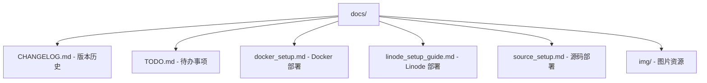

# /docs 目录文档

> **导航**: [根目录](../) | 本模块

---

## 📦 目录概览

项目文档目录，包含完整的用户指南、部署文档和开发手册。



---

## 📄 文档详解

### 1. 版本历史 (`CHANGELOG.md`)

**格式**: [Keep a Changelog](https://keepachangelog.com/zh-CN/1.0.0/) 标准

**结构示例**:
```markdown
# Changelog

All notable changes to this project will be documented in this file.

The format is based on [Keep a Changelog](https://keepachangelog.com/en/1.0.0/),
and this project adheres to [Semantic Versioning](https://semver.org/spec/v2.0.0.html).

## [Unreleased]

### Added
- 新功能

### Changed
- 变更功能

### Deprecated
- 即将废弃

### Removed
- 移除功能

### Fixed
- Bug 修复

### Security
- 安全更新

## [3.2.0] - 2025-11-08

### Changed
- README 修复
- Alert 冷却参数添加
```

**最新版本**: v3.2.0 (2025-11-08)

**更新内容**:
- README 修复
- Alert 冷却参数添加
- [查看完整历史](CHANGELOG.md)

**使用指南**:
```bash
# 查看版本差异
git log --oneline v3.1.0..v3.2.0

# 生成发布说明
github_changelog_generator --future-release=v3.3.0
```

**版本号规则**:
- **主版本 (X.y.z)**: 不兼容的 API 变更
- **次版本 (x.Y.z)**: 向后兼容的功能性新增
- **修订版本 (x.y.Z)**: 向后兼容的问题修正

---

### 2. 待办事项 (`TODO.md`)

**内容示例**:
```markdown
# TODO

## 高优先级
- [ ] 添加单元测试套件
- [ ] 实现 Redis 缓存层
- [ ] 添加 Web UI 管理界面

## 中优先级
- [ ] 支持更多交易所
- [ ] 优化 API 速率限制
- [ ] 添加邮件通知

## 低优先级
- [ ] 国际化支持
- [ ] 移动端 App
- [ ] 社区功能

## 已完成 ✓
- [x] Telegram Bot 命令系统
- [x] Binance API 集成
- [x] 技术指标支持
```

**优先级定义**:
- **高优先级**: 核心功能缺失或严重影响用户体验
- **中优先级**: 重要功能增强或性能优化
- **低优先级**: 锦上添花的功能

**使用方式**:
```bash
# 编辑文件
vim TODO.md

# 标记完成
✓ [x] 新功能

# 跟踪进度
grep -n "\[ \]" TODO.md | wc -l  # 剩余任务数
```

---

### 3. Docker 部署指南 (`docker_setup.md`)

**内容结构**:

1. **前置要求**
   - Docker 安装
   - Docker Compose 安装

2. **构建镜像**
   ```bash
   docker build -t crypto-alerts .
   ```

3. **运行容器**
   ```bash
   docker run -d \
     --name crypto-alerts \
     -e TELEGRAM_BOT_TOKEN=xxx \
     -e TAAPIIO_APIKEY=xxx \
     -v $(pwd)/data:/app/data \
     crypto-alerts
   ```

4. **Docker Compose 配置**
   ```yaml
   version: '3.8'
   services:
     crypto-alerts:
       build: .
       environment:
         - TELEGRAM_BOT_TOKEN=${TELEGRAM_BOT_TOKEN}
         - TAAPIIO_APIKEY=${TAAPIIO_APIKEY}
       volumes:
         - ./data:/app/data
       restart: unless-stopped
   ```

5. **健康检查**
   ```bash
   docker-compose ps
   docker logs crypto-alerts
   ```

6. **更新部署**
   ```bash
   docker-compose pull
   docker-compose up -d
   ```

**最佳实践**:
- ✅ 使用环境变量管理敏感信息
- ✅ 数据卷持久化存储
- ✅ 重启策略确保可用性
- ✅ 健康检查监控容器状态

---

### 4. Linode 部署指南 (`linode_setup_guide.md`)

**内容结构**:

1. **服务器准备**
   ```bash
   # 更新系统
   apt update && apt upgrade -y

   # 安装 Docker
   curl -fsSL https://get.docker.com -o get-docker.sh
   sh get-docker.sh
   ```

2. **安全配置**
   ```bash
   # 配置防火墙
   ufw enable
   ufw allow ssh
   ufw allow 80
   ufw allow 443

   # 创建非 root 用户
   adduser crypto
   usermod -aG docker crypto
   ```

3. **部署应用**
   ```bash
   # 克隆仓库
   git clone https://github.com/your/repo.git
   cd repo

   # 配置环境
   cp .env.example .env
   vim .env

   # 启动服务
   docker-compose up -d
   ```

4. **监控与维护**
   ```bash
   # 查看日志
   docker-compose logs -f

   # 监控资源
   htop
   df -h
   free -m

   # 设置自动更新
   crontab -e
   0 2 * * * cd /path/to/repo && git pull && docker-compose up -d
   ```

**推荐配置**:
- **实例**: Linode 2GB RAM (Nanode)
- **系统**: Ubuntu 22.04 LTS
- **磁盘**: 50GB SSD
- **网络**: 1TB 流量

**费用预估**:
- 基础配置: $5/月
- 包含: 1GB RAM, 1 vCPU, 25GB 存储

---

### 5. 源码部署指南 (`source_setup.md`)

**内容结构**:

1. **环境准备**
   ```bash
   # Python 3.9+
   python3 --version

   # 虚拟环境
   python3 -m venv venv
   source venv/bin/activate

   # 依赖安装
   pip install -r requirements.txt
   ```

2. **配置管理**
   ```bash
   # 复制配置模板
   cp .env.example .env

   # 编辑配置
   vim .env
   # 设置:
   # - TELEGRAM_BOT_TOKEN
   # - TAAPIIO_APIKEY (可选)
   # - MONGO_URI (可选)
   ```

3. **运行应用**
   ```bash
   # 开发模式
   python -m src

   # 后台运行
   nohup python -m src > bot.log 2>&1 &

   # 使用 systemd
   sudo cp scripts/crypto-alerts.service /etc/systemd/system/
   sudo systemctl enable crypto-alerts
   sudo systemctl start crypto-alerts
   ```

4. **日志管理**
   ```bash
   # 查看实时日志
   tail -f bot.log

   # 日志轮转
   sudo cp scripts/logrotate.conf /etc/logrotate.d/crypto-alerts
   ```

5. **性能优化**
   ```bash
   # 安装 Redis (可选)
   sudo apt install redis-server

   # 配置 PM2 (进程管理)
   npm install -g pm2
   pm2 start src/__main__.py --name crypto-alerts
   pm2 save
   pm2 startup
   ```

**开发环境**:
- **Python**: 3.9+
- **依赖**: requirements.txt
- **IDE**: VSCode + Python 扩展
- **调试**: `python -m pdb src/__main__.py`

---

### 6. 图片资源 (`img/`)

**内容**:
```bash
img/
  ├── bot_demo.png          # Bot 功能演示
  ├── architecture.png      # 系统架构图
  ├── deployment_flow.png   # 部署流程图
  └── indicators.png        # 技术指标截图
```

**用途**:
- README 插图
- 文档说明
- 演示材料
- 社交媒体分享

**格式规范**:
- 分辨率: 最低 1920x1080
- 格式: PNG (透明), JPG (照片)
- 大小: < 2MB
- 命名: snake_case

**优化建议**:
```bash
# 使用 imagemagick 优化
convert input.png -strip -quality 85 output.png

# 批量处理
for img in *.png; do
    convert "$img" -strip -quality 85 "optimized_$img"
done
```

---

## 📖 文档写作规范

### 格式标准
- **Markdown**: 所有文档使用 Markdown
- **标题层级**: 最多 H3
- **代码块**: 标注语言
- **链接**: 使用相对路径

### 内容要求
- ✅ 包含必要的前置条件
- ✅ 提供完整的命令示例
- ✅ 说明预期结果
- ✅ 常见问题解答

### 示例结构
```markdown
# 标题

## 概述
简要说明...

## 前置条件
- 要求 1
- 要求 2

## 步骤
1. 步骤一
   ```bash
   # 命令
   ```
2. 步骤二
   ```bash
   # 命令
   ```

## 验证
```bash
# 验证命令
```

## 故障排除
### 问题 1
解决方案...

### 问题 2
解决方案...
```

---

## 🔄 文档维护

### 更新流程
1. **修改代码** → 更新相关文档
2. **更新版本** → 记录到 CHANGELOG.md
3. **新功能** → 添加到 TODO.md
4. **部署变更** → 更新部署指南

### 版本同步
```bash
# 文档版本应与代码版本保持一致
VERSION=$(grep "version" src/setup.py | cut -d'"' -f2)
echo "Current version: $VERSION"

# 检查是否需要更新文档
git diff --name-only | grep "docs/" && echo "文档已更新"
```

### 自动化检查
```bash
# .github/workflows/docs.yml
name: Check Documentation
on: [push, pull_request]

jobs:
  docs:
    runs-on: ubuntu-latest
    steps:
      - uses: actions/checkout@v2
      - name: Check for broken links
        run: |
          pip install markdown-link-check
          find docs -name "*.md" -exec markdown-link-check {} \;
```

---

## 📊 文档质量指标

### 可读性评分
- **复杂度**: 简短句子，避免行话
- **结构**: 清晰的标题层级
- **示例**: 每个功能都有代码示例
- **图片**: 适当使用图片辅助说明

### 完整性检查
```bash
# 检查文档覆盖率
echo "检查文档是否存在:"
for doc in docker_setup linode_setup source_setup; do
    if [ -f "docs/${doc}.md" ]; then
        echo "✓ $doc.md"
    else
        echo "✗ $doc.md 缺失"
    fi
done
```

### 链接有效性
```bash
# 验证内部链接
grep -r "](/" docs/ | while read line; do
    link=$(echo "$line" | sed 's/.*](\([^)]*\)).*/\1/')
    if [[ ! "$link" =~ ^http ]]; then
        if [ ! -f "docs/$link" ]; then
            echo "⚠ 失效链接: $link"
        fi
    fi
done
```

---

## 🚀 文档增强计划

### v4.0 改进
- [ ] **互动教程**: 使用 Gitpod 提供在线试用
- [ ] **视频指南**: 录制部署演示视频
- [ ] **自动生成**: 从代码注释自动生成 API 文档
- [ ] **多语言**: 翻译为英文、日文

### v4.1 扩展
- [ ] **知识库**: 集成 GitHub Wiki
- [ ] **社区贡献**: 开放文档编辑权限
- [ ] **反馈系统**: 文档质量打分
- [ ] **搜索功能**: 添加全文搜索

---

## 📚 文档资源

### 学习资源
- [Markdown 语法指南](https://www.markdownguide.org/)
- [Keep a Changelog 标准](https://keepachangelog.com/)
- [GitBook 文档平台](https://www.gitbook.com/)
- [VuePress 静态站点](https://vuepress.vuejs.org/)

### 工具推荐
- **Typora**: Markdown 编辑器
- **Shields.io**: README 徽章
- **Mermaid.live**: 流程图编辑
- **GitHub Pages**: 文档托管

---

*Generated with Claude Code - 2025-11-08*
