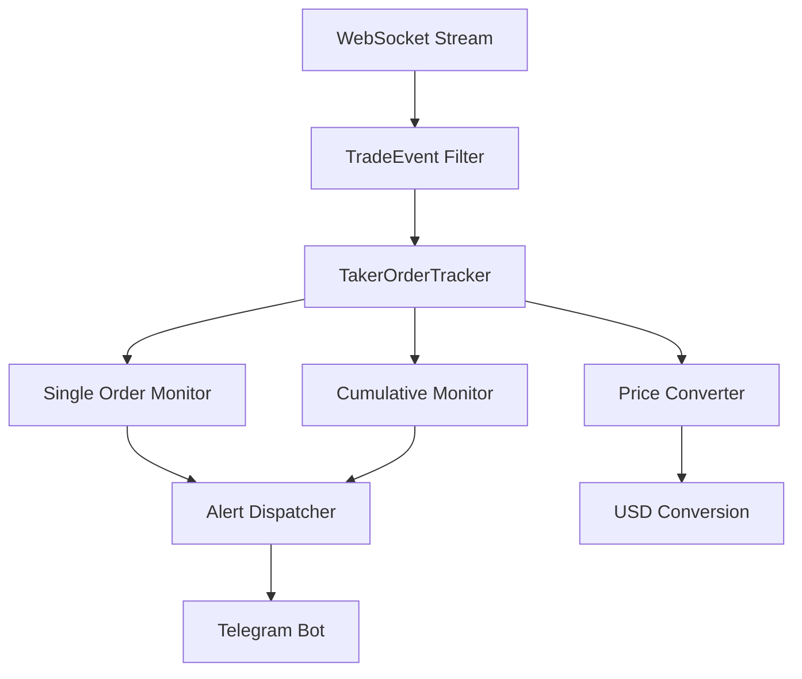
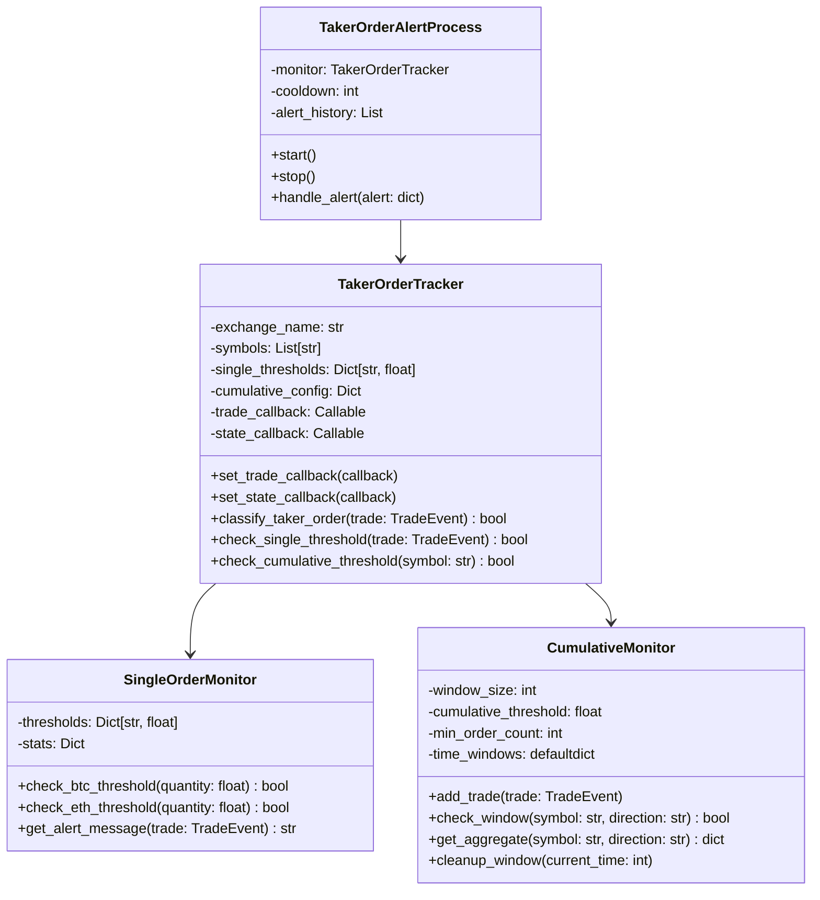
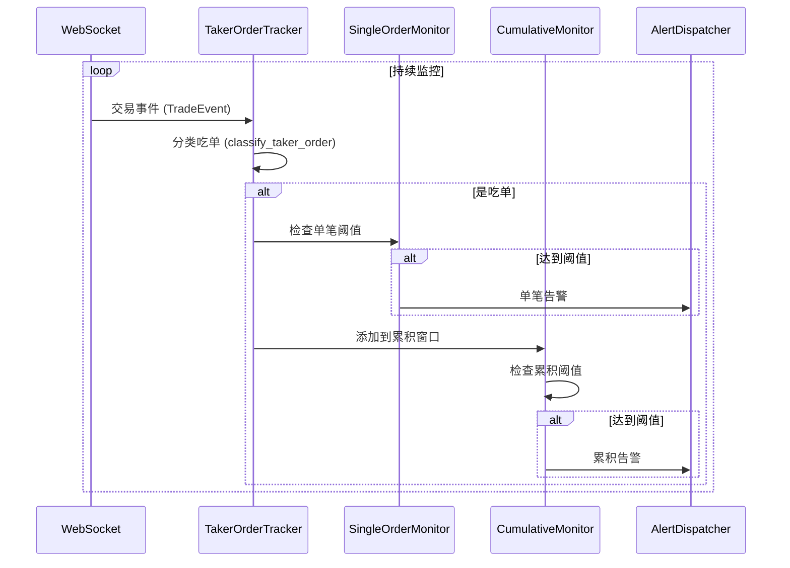
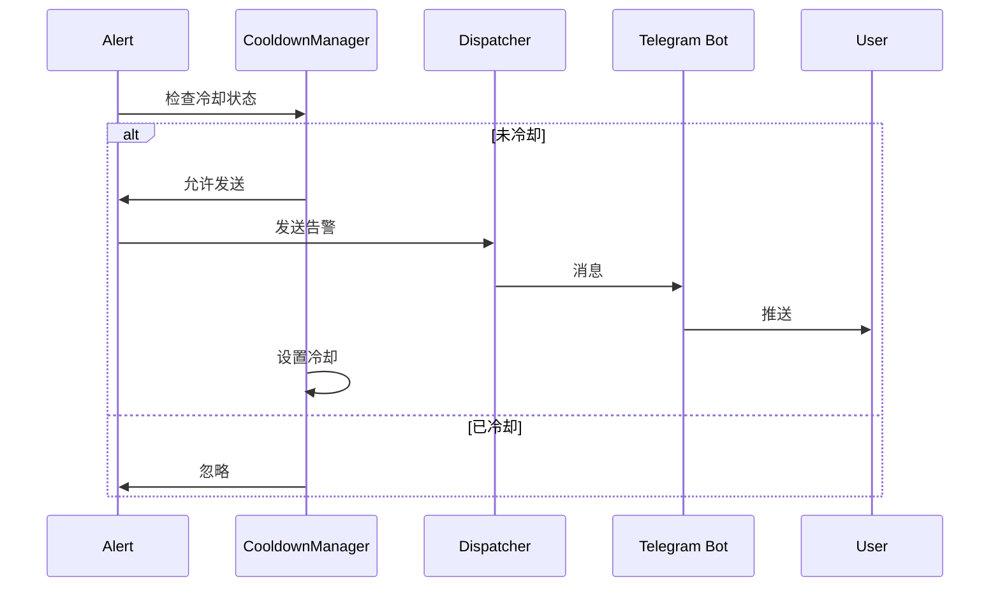

# OpenSpec 技术规范：4.3.4 吃单监控

## 📋 规范信息

**规范编号**: SPEC-2025-0105
**版本**: v1.0.0
**创建日期**: 2025-11-09
**状态**: 草案 (Draft)
**适用范围**: 所有开发者、测试人员、运维人员

---

## 🎯 规范目的

定义吃单监控系统的技术实现细节，确保系统能够：
- 实时监控 BTC/ETH 单笔大额吃单订单
- 检测 1 分钟内累积吃单活动
- 准确区分吃单和挂单
- 提供及时、准确的告警通知

---

## 📦 依赖规范

### 现有组件
- 大额订单监控系统 (`src/monitor/large_orders/`)
- WebSocket 客户端 (`src/monitor/large_orders/exchanges/binance.py`)
- 价格转换器 (`src/monitor/large_orders/src/price_converter.py`)
- 错误恢复机制 (`src/monitor/large_orders/src/error_recovery.py`)

### 外部依赖
- `websockets`: WebSocket 客户端库
- `asyncio`: 异步编程框架
- `json`: 数据序列化
- `datetime`: 时间处理
- `collections`: 数据结构 (deque, defaultdict)

---

## 🏗️ 架构设计

### 1. 整体架构



### 2. 核心类图



---

## 📊 数据模型

### 1. TradeEvent (扩展)

```python
@dataclass
class TradeEvent:
    """交易事件（扩展吃单标识）"""
    exchange: str
    symbol: str
    side: str  # BUY/SELL
    order_type: str
    price: float
    quantity: float
    amount: float
    trade_time: int
    is_taker: bool  # 新增：是否为吃单
    taker_rate: float  # 新增：吃单率
    trade_id: str
    raw_data: dict
```

### 2. TakerAlert

```python
@dataclass
class TakerAlert:
    """吃单告警"""
    alert_type: str  # SINGLE_ORDER / CUMULATIVE
    symbol: str
    direction: str  # BUY / SELL
    timestamp: int
    # 单笔告警
    quantity: float = None
    amount_usd: float = None
    # 累积告警
    order_count: int = None
    total_amount_usd: float = None
    avg_amount_usd: float = None
    time_range: tuple = None  # (start_time, end_time)
    # 告警控制
    cooldown_until: int = None
```

### 3. 配置文件

```python
# src/monitor/taker_orders/config.py
TAKER_CONFIG = {
    "single_thresholds": {
        "BTCUSDT": {
            "quantity": 50,  # BTC 数量
            "min_amount_usd": 2500000  # 最小 USD 金额
        },
        "ETHUSDT": {
            "quantity": 2000,  # ETH 数量
            "min_amount_usd": 4000000  # 最小 USD 金额
        }
    },
    "cumulative": {
        "window_size": 60,  # 1分钟窗口（秒）
        "threshold_usd": 1000000,  # $1M USD
        "min_order_count": 5,  # 最少订单数
        "directions": ["BUY", "SELL"]  # 监控方向
    },
    "cooldown": {
        "single_order": 60,  # 单笔告警冷却（秒）
        "cumulative": 300,   # 累积告警冷却（秒）
        "per_symbol": True   # 每交易对独立冷却
    }
}
```

---

## 🔌 接口定义

### 1. TakerOrderTracker

```python
class TakerOrderTracker:
    """吃单订单追踪器"""

    def __init__(
        self,
        exchange_name: str,
        symbols: List[str],
        config: Dict[str, Any]
    ):
        """初始化

        Args:
            exchange_name: 交易所名称
            symbols: 监控的交易对列表
            config: 配置文件
        """
        self.exchange_name = exchange_name
        self.symbols = symbols
        self.config = config
        self.single_thresholds = config["single_thresholds"]
        self.cumulative_config = config["cumulative"]
        self.cooldown_config = config["cooldown"]
        self.trade_callback = None
        self.state_callback = None

        # 深度数据缓存：symbol -> {bids, asks, timestamp}
        self.depth_cache = {}
        # 交易去重：trade_id -> timestamp
        self.trade_dedup = {}
        # 统计信息
        self.stats = {
            "total_trades": 0,
            "taker_trades": 0,
            "maker_trades": 0,
            "classification_errors": 0,
            "reconnect_count": 0
        }

    def set_trade_callback(self, callback: Callable[[TakerAlert], None]):
        """设置交易回调函数"""
        self.trade_callback = callback

    def set_state_callback(self, callback: Callable[[str], None]):
        """设置状态回调函数"""
        self.state_callback = callback

    async def start(self):
        """启动监控"""
        self._update_state("starting")
        # 启动WebSocket连接
        # 订阅交易流和深度流
        pass

    async def stop(self):
        """停止监控"""
        self._update_state("stopping")
        # 关闭WebSocket连接
        # 清理资源
        pass

    def update_depth(self, symbol: str, depth_data: dict, timestamp: int):
        """更新订单簿深度数据

        Args:
            symbol: 交易对 (如 BTCUSDT)
            depth_data: 深度数据 {"bids": [[price, qty], ...], "asks": [[price, qty], ...]}
            timestamp: 时间戳（毫秒）
        """
        # 记录深度快照
        self.depth_cache[symbol] = {
            "bids": depth_data.get("b", depth_data.get("bids", [])),
            "asks": depth_data.get("a", depth_data.get("asks", [])),
            "timestamp": timestamp
        }

        # 清理过期深度数据（超过5秒）
        cutoff = timestamp - 5000
        if symbol in self.depth_cache:
            if self.depth_cache[symbol]["timestamp"] < cutoff:
                del self.depth_cache[symbol]

    def classify_taker_order(self, trade: TradeEvent) -> bool:
        """分类吃单

        通过比较交易前后的订单簿深度变化判断是否为吃单（主动成交）

        吃单特征：移除流动性
        - 买单成交：卖单深度减少（价格从低到高消耗）
        - 卖单成交：买单深度减少（价格从高到低消耗）

        挂单特征：提供流动性
        - 买单成交：买单深度增加（价格不变或更高）
        - 卖单成交：卖单深度增加（价格不变或更低）

        Args:
            trade: 交易事件

        Returns:
            bool: True 表示为吃单，False 表示为挂单

        Raises:
            ValueError: 当无法获取足够深度数据时
        """
        try:
            # 1. 验证数据源
            if trade.symbol not in self.depth_cache:
                logger.warning(f"No depth data for {trade.symbol}, cannot classify")
                return False  # 保守策略：默认不告警

            current_depth = self.depth_cache[trade.symbol]
            depth_time = current_depth["timestamp"]
            trade_time = trade.trade_time

            # 检查时间同步（深度数据不应比交易数据新超过1秒）
            if abs(depth_time - trade_time) > 1000:
                logger.warning(f"Depth data too old for {trade.symbol}: "
                             f"depth={depth_time}, trade={trade_time}")
                return False

            # 2. 解析深度数据
            bids = current_depth["bids"]  # [[price, qty], ...]
            asks = current_depth["asks"]  # [[price, qty], ...]

            if not bids or not asks:
                logger.warning(f"Empty depth data for {trade.symbol}")
                return False

            # 3. 基于成交方向和价格判断

            # 对于买单（ BUY）：价格应 >= 最低卖价
            # 对于卖单（ SELL）：价格应 <= 最高买价
            if trade.side == "BUY":
                # 获取最低卖价
                lowest_ask = float(asks[0][0])  # 卖单按价格升序
                price_diff = abs(trade.price - lowest_ask) / lowest_ask

                # 如果成交价明显高于最低卖价，可能是大额吃单
                # 如果成交价等于最低卖价，可能是挂单成交
                if price_diff > 0.0001:  # 0.01%以上差异
                    return True
                elif price_diff < 0.00005:  # 0.005%以下，可能是挂单
                    return False

            elif trade.side == "SELL":
                # 获取最高买价
                highest_bid = float(bids[0][0])  # 买单按价格降序
                price_diff = abs(trade.price - highest_bid) / highest_bid

                if price_diff > 0.0001:  # 0.01%以上差异
                    return True
                elif price_diff < 0.00005:  # 0.005%以下，可能是挂单
                    return False

            # 4. 如果价格相等或差异很小，通过数量判断
            # 大数量更可能是吃单
            if trade.quantity > 10:  # 大于10个币单位
                return True

            # 5. 默认保守策略：认为是挂单
            return False

        except (KeyError, IndexError, ValueError) as e:
            self.stats["classification_errors"] += 1
            logger.error(f"Classification error for {trade.symbol}: {e}")
            return False  # 出现错误时保守处理

    def validate_data_source(self) -> Dict[str, bool]:
        """验证数据源可用性

        Returns:
            Dict: {symbol: is_valid}
        """
        validation = {}
        for symbol in self.symbols:
            # 检查深度数据
            has_depth = symbol in self.depth_cache
            # 检查数据新鲜度（5秒内）
            is_fresh = False
            if has_depth:
                age = time.time() * 1000 - self.depth_cache[symbol]["timestamp"]
                is_fresh = age < 5000

            validation[symbol] = has_depth and is_fresh

        return validation

    def _update_state(self, new_state: str):
        """更新监控状态"""
        if self.state_callback:
            self.state_callback(new_state)

    def _deduplicate_trade(self, trade_id: str) -> bool:
        """去重检查，返回True表示是重复交易"""
        if trade_id in self.trade_dedup:
            return True

        # 记录交易ID和当前时间
        self.trade_dedup[trade_id] = time.time()

        # 清理超过1小时的旧记录
        cutoff = time.time() - 3600
        self.trade_dedup = {
            tid: t for tid, t in self.trade_dedup.items()
            if t > cutoff
        }

        return False

    def check_single_threshold(self, trade: TradeEvent) -> bool:
        """检查单笔订单阈值

        Args:
            trade: 交易事件

        Returns:
            bool: 是否达到阈值
        """
        symbol = trade.symbol
        if symbol not in self.single_thresholds:
            return False

        threshold = self.single_thresholds[symbol]
        quantity = trade.quantity

        if symbol == "BTCUSDT":
            return quantity >= threshold["quantity"]
        elif symbol == "ETHUSDT":
            return quantity >= threshold["quantity"]

        return False

    def check_cumulative_threshold(
        self,
        symbol: str,
        direction: str,
        current_time: int
    ) -> Tuple[bool, Optional[Dict]]:
        """检查累积阈值

        Args:
            symbol: 交易对
            direction: 方向 (BUY/SELL)
            current_time: 当前时间戳

        Returns:
            Tuple[bool, Optional[Dict]]: (是否达到阈值, 聚合数据)
        """
        window_size = self.cumulative_config["window_size"]
        threshold_usd = self.cumulative_config["threshold_usd"]
        min_order_count = self.cumulative_config["min_order_count"]

        # 获取时间窗口内的交易
        window_key = f"{symbol}_{direction}"
        trades = self._get_window_trades(window_key, current_time)

        # 过滤吃单
        taker_trades = [t for t in trades if self.classify_taker_order(t)]

        # 检查订单数量
        if len(taker_trades) < min_order_count:
            return False, None

        # 计算总金额
        total_amount_usd = sum(self._convert_to_usd(t) for t in taker_trades)

        # 检查金额阈值
        if total_amount_usd < threshold_usd:
            return False, None

        # 返回聚合数据
        avg_amount = total_amount_usd / len(taker_trades)
        return True, {
            "order_count": len(taker_trades),
            "total_amount_usd": total_amount_usd,
            "avg_amount_usd": avg_amount,
            "start_time": current_time - window_size,
            "end_time": current_time
        }

    def _convert_to_usd(self, trade: TradeEvent) -> float:
        """转换为 USD 金额"""
        # 复用价格转换器
        # 实现细节...
        return trade.amount

    def _get_window_trades(
        self,
        window_key: str,
        current_time: int
    ) -> List[TradeEvent]:
        """获取时间窗口内的交易"""
        # 实现滚动窗口
        # 返回指定窗口内的交易列表
        pass
```

### 2. SingleOrderMonitor

```python
class SingleOrderMonitor:
    """单笔订单监控器"""

    def __init__(self, thresholds: Dict[str, Dict]):
        self.thresholds = thresholds
        self.stats = {
            "single_order_alerts": 0,
            "btc_alerts": 0,
            "eth_alerts": 0
        }

    def check_btc_threshold(self, quantity: float) -> bool:
        """检查 BTC 阈值"""
        return quantity >= self.thresholds["BTCUSDT"]["quantity"]

    def check_eth_threshold(self, quantity: float) -> bool:
        """检查 ETH 阈值"""
        return quantity >= self.thresholds["ETHUSDT"]["quantity"]

    def get_alert_message(self, trade: TradeEvent) -> str:
        """生成告警消息"""
        symbol = trade.symbol
        direction = "主动买入" if trade.side == "BUY" else "主动卖出"

        if symbol == "BTCUSDT":
            return (
                f"[吃单监控] {symbol}\n"
                f"单笔大额吃单告警！\n"
                f"方向: {direction}\n"
                f"数量: {trade.quantity:.2f} BTC\n"
                f"金额: ${trade.amount:,.2f}\n"
                f"时间: {datetime.fromtimestamp(trade.trade_time/1000).strftime('%H:%M:%S')}"
            )
        elif symbol == "ETHUSDT":
            return (
                f"[吃单监控] {symbol}\n"
                f"单笔大额吃单告警！\n"
                f"方向: {direction}\n"
                f"数量: {trade.quantity:.0f} ETH\n"
                f"金额: ${trade.amount:,.2f}\n"
                f"时间: {datetime.fromtimestamp(trade.trade_time/1000).strftime('%H:%M:%S')}"
            )
```

### 3. CumulativeMonitor

```python
class CumulativeMonitor:
    """累积监控器"""

    def __init__(self, config: Dict[str, Any]):
        self.window_size = config["window_size"]
        self.threshold_usd = config["threshold_usd"]
        self.min_order_count = config["min_order_count"]
        self.time_windows = defaultdict(list)
        self.stats = {
            "cumulative_alerts": 0,
            "buy_alerts": 0,
            "sell_alerts": 0
        }

    def add_trade(self, trade: TradeEvent, is_taker: bool):
        """添加交易到窗口"""
        if not is_taker:
            return

        current_time = int(trade.trade_time / 1000)  # 转换为秒

        # 为每个方向创建窗口
        for direction in [trade.side]:
            window_key = f"{trade.symbol}_{direction}"
            self.time_windows[window_key].append({
                "trade": trade,
                "timestamp": current_time,
                "amount_usd": self._convert_to_usd(trade)
            })

        # 清理过期数据
        self.cleanup_windows(current_time)

    def cleanup_windows(self, current_time: int):
        """清理过期窗口数据"""
        cutoff_time = current_time - self.window_size

        for window_key in list(self.time_windows.keys()):
            trades = self.time_windows[window_key]
            # 保留窗口内的交易
            self.time_windows[window_key] = [
                t for t in trades
                if t["timestamp"] > cutoff_time
            ]
            # 删除空窗口
            if not self.time_windows[window_key]:
                del self.time_windows[window_key]

    def check_window(
        self,
        symbol: str,
        direction: str,
        current_time: int
    ) -> Tuple[bool, Optional[Dict]]:
        """检查窗口是否达到阈值"""
        window_key = f"{symbol}_{direction}"
        trades = self.time_windows.get(window_key, [])

        if len(trades) < self.min_order_count:
            return False, None

        # 计算总金额
        total_amount_usd = sum(t["amount_usd"] for t in trades)

        if total_amount_usd < self.threshold_usd:
            return False, None

        # 返回聚合数据
        avg_amount = total_amount_usd / len(trades)
        return True, {
            "order_count": len(trades),
            "total_amount_usd": total_amount_usd,
            "avg_amount_usd": avg_amount,
            "start_time": current_time - self.window_size,
            "end_time": current_time
        }

    def _convert_to_usd(self, trade: TradeEvent) -> float:
        """转换为 USD 金额"""
        # 使用价格转换器
        # 简化实现：直接返回 amount
        return trade.amount
```

### 4. TakerOrderAlertProcess

```python
class TakerOrderAlertProcess(BaseAlertProcess):
    """吃单告警处理进程"""

    def __init__(self, bot: "TelegramBot"):
        super().__init__()
        self.bot = bot
        self.config = load_config()["taker_order"]
        self.monitor = TakerOrderTracker(
            exchange_name="binance",
            symbols=["BTCUSDT", "ETHUSDT"],
            config=self.config
        )
        self.alert_history = []
        self.cooldowns = {}  # symbol -> timestamp

    def poll_user_alerts(self, tg_user_id: str) -> None:
        """轮询用户告警（此功能无轮询）"""
        pass

    def run(self):
        """运行监控"""
        # 启动 WebSocket 监控
        # 处理交易事件
        # 发送告警
        pass

    def handle_trade(self, trade: TradeEvent):
        """处理交易事件"""
        # 1. 检查是否为吃单
        is_taker = self.monitor.classify_taker_order(trade)

        # 2. 检查单笔阈值
        if self.monitor.check_single_threshold(trade):
            self._send_single_alert(trade)

        # 3. 检查累积阈值
        current_time = int(trade.trade_time / 1000)
        for direction in ["BUY", "SELL"]:
            triggered, data = self.monitor.check_cumulative_threshold(
                trade.symbol,
                direction,
                current_time
            )
            if triggered:
                self._send_cumulative_alert(trade.symbol, direction, data)

    def _send_single_alert(self, trade: TradeEvent):
        """发送单笔告警"""
        symbol = trade.symbol

        # 检查冷却
        if self._is_in_cooldown(symbol, "single"):
            return

        # 生成告警
        alert = TakerAlert(
            alert_type="SINGLE_ORDER",
            symbol=symbol,
            direction=trade.side,
            timestamp=trade.trade_time,
            quantity=trade.quantity,
            amount_usd=self._convert_to_usd(trade)
        )

        # 发送告警
        self._dispatch_alert(alert)

        # 设置冷却
        self._set_cooldown(symbol, "single")

    def _send_cumulative_alert(
        self,
        symbol: str,
        direction: str,
        data: Dict
    ):
        """发送累积告警"""
        # 检查冷却
        key = f"{symbol}_{direction}"
        if self._is_in_cooldown(key, "cumulative"):
            return

        # 生成告警
        alert = TakerAlert(
            alert_type="CUMULATIVE",
            symbol=symbol,
            direction=direction,
            timestamp=datetime.now().timestamp() * 1000,
            order_count=data["order_count"],
            total_amount_usd=data["total_amount_usd"],
            avg_amount_usd=data["avg_amount_usd"],
            time_range=(data["start_time"], data["end_time"])
        )

        # 发送告警
        self._dispatch_alert(alert)

        # 设置冷却
        self._set_cooldown(key, "cumulative")

    def _dispatch_alert(self, alert: TakerAlert):
        """分发告警"""
        # 生成消息
        message = self._format_message(alert)

        # 发送到所有白名单用户
        whitelist = self.bot.whitelist_db.get_all()
        for user_id in whitelist:
            try:
                self.bot.send_message(user_id, message)
            except Exception as e:
                logger.error(f"Failed to send alert to {user_id}: {e}")

        # 记录告警历史
        self.alert_history.append(alert)

    def _format_message(self, alert: TakerAlert) -> str:
        """格式化告警消息"""
        if alert.alert_type == "SINGLE_ORDER":
            direction = "主动买入" if alert.direction == "BUY" else "主动卖出"
            symbol = alert.symbol

            if symbol == "BTCUSDT":
                return (
                    f"🚨 [吃单监控] {symbol}\n"
                    f"━━━━━━━━━━━━━━━━━━\n"
                    f"📊 单笔大额吃单告警！\n"
                    f"🔄 方向: {direction}\n"
                    f"💰 数量: {alert.quantity:.2f} BTC\n"
                    f"💵 金额: ${alert.amount_usd:,.2f}\n"
                    f"⏰ 时间: {datetime.fromtimestamp(alert.timestamp/1000).strftime('%H:%M:%S')}"
                )
            else:  # ETHUSDT
                return (
                    f"🚨 [吃单监控] {symbol}\n"
                    f"━━━━━━━━━━━━━━━━━━\n"
                    f"📊 单笔大额吃单告警！\n"
                    f"🔄 方向: {direction}\n"
                    f"💰 数量: {alert.quantity:.0f} ETH\n"
                    f"💵 金额: ${alert.amount_usd:,.2f}\n"
                    f"⏰ 时间: {datetime.fromtimestamp(alert.timestamp/1000).strftime('%H:%M:%S')}"
                )

        else:  # CUMULATIVE
            direction = "主动买入" if alert.direction == "BUY" else "主动卖出"
            start_time = datetime.fromtimestamp(alert.time_range[0]).strftime('%H:%M:%S')
            end_time = datetime.fromtimestamp(alert.time_range[1]).strftime('%H:%M:%S')

            return (
                f"⚡ [吃单监控] {alert.symbol}\n"
                f"━━━━━━━━━━━━━━━━━━\n"
                f"📈 累积吃单活动告警！\n"
                f"⏱️  时间范围: {start_time}-{end_time} (60秒)\n"
                f"🔄 方向: {direction}\n"
                f"📊 订单数: {alert.order_count}笔\n"
                f"💰 总金额: ${alert.total_amount_usd:,.2f}\n"
                f"📉 平均金额: ${alert.avg_amount_usd:,.2f}"
            )
```

---

## 🔄 流程定义

### 1. 监控流程



### 2. 告警流程



---

## ⚙️ 配置规范

### 1. 配置文件结构

```yaml
# config/taker_order.yaml
taker_order:
  enabled: true

  # 单笔订单阈值
  single_thresholds:
    BTCUSDT:
      quantity: 50  # BTC 数量
      min_amount_usd: 2500000  # 最小 USD 金额
    ETHUSDT:
      quantity: 2000  # ETH 数量
      min_amount_usd: 4000000  # 最小 USD 金额

  # 累积监控
  cumulative:
    window_size: 60  # 窗口大小（秒）
    threshold_usd: 1000000  # 阈值（USD）
    min_order_count: 5  # 最少订单数

  # 冷却配置
  cooldown:
    single_order: 60  # 单笔告警冷却（秒）
    cumulative: 300   # 累积告警冷却（秒）
    per_symbol: true  # 每交易对独立冷却

  # WebSocket 配置
  websocket:
    reconnect_attempts: 5
    reconnect_delay: 5
    ping_interval: 20
    ping_timeout: 10
```

---

## 🧪 测试规范

### 1. 单元测试

#### 分类算法测试
```python
# tests/test_taker_order_monitor/test_classifier.py
import pytest
from unittest.mock import Mock, patch
from src.monitor.taker_orders.src.tracker import TakerOrderTracker

class TestTakerOrderClassifier:
    @pytest.fixture
    def tracker(self):
        """创建测试追踪器"""
        config = {
            "single_thresholds": {"BTCUSDT": {"quantity": 50}},
            "cumulative": {"window_size": 60},
            "cooldown": {"single_order": 60}
        }
        return TakerOrderTracker("binance", ["BTCUSDT"], config)

    def test_classify_taker_order_buy_above_ask(self, tracker):
        """测试买单高于最低卖价（吃单）"""
        # 设置深度数据：最低卖价50000
        tracker.update_depth("BTCUSDT", {
            "bids": [["50000", "10"]],
            "asks": [["50000", "5"], ["50001", "10"]]
        }, timestamp=1000)

        # 创建买单：价格50001（高于最低卖价）
        trade = Mock()
        trade.symbol = "BTCUSDT"
        trade.side = "BUY"
        trade.price = 50001
        trade.trade_time = 1000

        result = tracker.classify_taker_order(trade)
        assert result is True  # 吃单

    def test_classify_maker_order_buy_at_ask(self, tracker):
        """测试买单等于最低卖价（挂单）"""
        tracker.update_depth("BTCUSDT", {
            "bids": [["50000", "10"]],
            "asks": [["50000", "5"], ["50001", "10"]]
        }, timestamp=1000)

        # 创建买单：价格50000（等于最低卖价）
        trade = Mock()
        trade.symbol = "BTCUSDT"
        trade.side = "BUY"
        trade.price = 50000
        trade.trade_time = 1000

        result = tracker.classify_taker_order(trade)
        assert result is False  # 挂单

    def test_classify_taker_order_sell_below_bid(self, tracker):
        """测试卖单低于最高买价（吃单）"""
        tracker.update_depth("BTCUSDT", {
            "bids": [["50000", "5"], ["49999", "10"]],
            "asks": [["50001", "10"]]
        }, timestamp=1000)

        # 创建卖单：价格49999（低于最高买价）
        trade = Mock()
        trade.symbol = "BTCUSDT"
        trade.side = "SELL"
        trade.price = 49999
        trade.trade_time = 1000

        result = tracker.classify_taker_order(trade)
        assert result is True  # 吃单

    def test_classify_no_depth_data(self, tracker):
        """测试无深度数据（保守策略）"""
        trade = Mock()
        trade.symbol = "BTCUSDT"
        trade.side = "BUY"
        trade.price = 50000
        trade.trade_time = 1000

        result = tracker.classify_taker_order(trade)
        assert result is False  # 保守策略：默认挂单

    def test_classify_stale_depth_data(self, tracker):
        """测试过期深度数据（5秒以上）"""
        old_time = time.time() * 1000 - 6000  # 6秒前
        tracker.update_depth("BTCUSDT", {
            "bids": [["50000", "10"]],
            "asks": [["50001", "10"]]
        }, timestamp=old_time)

        trade = Mock()
        trade.symbol = "BTCUSDT"
        trade.side = "BUY"
        trade.price = 50001
        trade.trade_time = 1000

        result = tracker.classify_taker_order(trade)
        assert result is False  # 数据过期，保守策略

    def test_classify_large_quantity(self, tracker):
        """测试大数量交易（>10币单位）"""
        tracker.update_depth("BTCUSDT", {
            "bids": [["50000", "10"]],
            "asks": [["50000", "5"]]
        }, timestamp=1000)

        trade = Mock()
        trade.symbol = "BTCUSDT"
        trade.side = "BUY"
        trade.price = 50000
        trade.quantity = 50  # 大于10
        trade.trade_time = 1000

        result = tracker.classify_taker_order(trade)
        # 数量大，即使是挂单价格也可能是吃单
        assert result is True

    def test_deduplication(self, tracker):
        """测试交易去重"""
        trade_id = "test_trade_123"
        # 第一次应该返回False（非重复）
        assert tracker._deduplicate_trade(trade_id) is False
        # 第二次应该返回True（重复）
        assert tracker._deduplicate_trade(trade_id) is True

    def test_validate_data_source(self, tracker):
        """测试数据源验证"""
        # 无数据
        validation = tracker.validate_data_source()
        assert validation["BTCUSDT"] is False

        # 有新鲜数据
        tracker.update_depth("BTCUSDT", {
            "bids": [["50000", "10"]],
            "asks": [["50001", "10"]]
        }, timestamp=time.time() * 1000)
        validation = tracker.validate_data_source()
        assert validation["BTCUSDT"] is True
```

#### 性能测试
```python
# tests/test_taker_order_monitor/test_performance.py
import time
import pytest
from src.monitor.taker_orders.src.tracker import TakerOrderTracker

class TestPerformance:
    @pytest.mark.performance
    def test_classification_latency(self):
        """测试分类延迟 < 50ms"""
        tracker = create_tracker()

        # 创建1000笔测试交易
        start = time.time()
        for _ in range(1000):
            trade = create_random_trade()
            tracker.classify_taker_order(trade)
        end = time.time()

        avg_latency = (end - start) / 1000 * 1000  # ms
        assert avg_latency < 50, f"Average latency: {avg_latency}ms"

    @pytest.mark.performance
    def test_high_throughput(self):
        """测试高吞吐量 > 1000 trades/sec"""
        tracker = create_tracker()

        start = time.time()
        for _ in range(1000):
            trade = create_random_trade()
            tracker.classify_taker_order(trade)
        end = time.time()

        elapsed = end - start
        throughput = 1000 / elapsed
        assert throughput > 1000, f"Throughput: {throughput} trades/sec"

    @pytest.mark.performance
    def test_memory_usage(self):
        """测试内存使用 < 200MB"""
        import psutil
        import os

        process = psutil.Process(os.getpid())
        initial_memory = process.memory_info().rss / 1024 / 1024  # MB

        tracker = create_tracker()

        # 模拟大量交易
        for _ in range(10000):
            trade = create_random_trade()
            tracker.classify_taker_order(trade)

        final_memory = process.memory_info().rss / 1024 / 1024  # MB
        memory_increase = final_memory - initial_memory

        assert memory_increase < 200, f"Memory increase: {memory_increase}MB"

    @pytest.mark.performance
    def test_accuracy_under_load(self):
        """测试高负载下准确率"""
        tracker = create_tracker()

        # 模拟1000笔已知结果的交易
        test_cases = load_test_dataset("taker_classification_test.json")

        correct = 0
        total = len(test_cases)

        for case in test_cases:
            trade = create_trade_from_case(case)
            result = tracker.classify_taker_order(trade)
            expected = case["is_taker"]

            if result == expected:
                correct += 1

        accuracy = correct / total
        assert accuracy > 0.95, f"Accuracy: {accuracy*100}%"
```

### 2. 集成测试

```python
# tests/test_taker_order_monitor/test_integration.py
import pytest
from unittest.mock import AsyncMock, patch
from src.monitor.taker_orders.core.monitor import TakerOrderMonitor

class TestTakerOrderIntegration:
    @pytest.mark.asyncio
    async def test_full_workflow(self):
        """测试完整工作流"""
        # 1. 启动监控
        monitor = TakerOrderMonitor()
        monitor.start = AsyncMock()

        # 2. 模拟WebSocket数据
        with patch('websockets.connect') as mock_connect:
            mock_ws = AsyncMock()
            mock_connect.return_value = mock_ws

            # 模拟深度数据
            depth_message = {
                "stream": "btcusdt@depth",
                "data": {
                    "b": [["50000", "10"]],  # bids
                    "a": [["50001", "10"]],  # asks
                    "E": 1234567890000
                }
            }

            # 模拟交易数据
            trade_message = {
                "stream": "btcusdt@trade",
                "data": {
                    "s": "BTCUSDT",
                    "p": "50001",  # 价格
                    "q": "50",     # 数量
                    "m": True,     # 买方是否为做市商
                    "E": 1234567890000
                }
            }

            # 3. 处理消息
            await monitor._process_message(depth_message)
            await monitor._process_message(trade_message)

            # 4. 验证结果
            assert monitor.tracker.validate_data_source()["BTCUSDT"] is True

    @pytest.mark.asyncio
    async def test_websocket_reconnection(self):
        """测试WebSocket重连机制"""
        monitor = TakerOrderMonitor()

        with patch('websockets.connect') as mock_connect:
            # 第一次连接失败
            mock_connect.side_effect = [
                ConnectionError("First attempt failed"),
                AsyncMock()  # 第二次成功
            ]

            await monitor.connect_websocket()

            # 验证重连次数
            assert mock_connect.call_count == 2
            assert monitor.reconnect_count == 1

    @pytest.mark.asyncio
    async def test_cooldown_mechanism(self):
        """测试冷却机制"""
        monitor = create_monitor()

        trade = create_test_trade(quantity=50)

        # 第一次告警
        result1 = await monitor.handle_trade(trade)
        assert result1 is True

        # 立即再次告警（应该被冷却）
        result2 = await monitor.handle_trade(trade)
        assert result2 is False

        # 等待冷却时间后
        await asyncio.sleep(0.1)  # 模拟冷却
        result3 = await monitor.handle_trade(trade)
        assert result3 is True
```

### 3. 压力测试

```python
# tests/test_taker_order_monitor/test_stress.py
import asyncio
import pytest
from src.monitor.taker_orders.core.monitor import TakerOrderMonitor

class TestStress:
    @pytest.mark.stress
    @pytest.mark.asyncio
    async def test_1000_trades_per_second(self):
        """测试每秒1000笔交易处理能力"""
        monitor = TakerOrderMonitor()

        start_time = time.time()
        tasks = []

        # 生成1000笔交易
        for _ in range(1000):
            trade = create_random_trade()
            task = asyncio.create_task(monitor.handle_trade(trade))
            tasks.append(task)

        # 等待所有任务完成
        await asyncio.gather(*tasks)

        elapsed = time.time() - start_time
        throughput = 1000 / elapsed

        assert throughput >= 1000, f"Throughput: {throughput} trades/sec"
        assert elapsed <= 1.0, f"Processing took too long: {elapsed}s"

    @pytest.mark.stress
    @pytest.mark.asyncio
    async def test_memory_leak(self):
        """测试内存泄漏"""
        import psutil
        import gc

        process = psutil.Process()
        initial_memory = process.memory_info().rss

        monitor = TakerOrderMonitor()

        # 持续处理交易30秒
        for _ in range(30):
            for _ in range(100):
                trade = create_random_trade()
                await monitor.handle_trade(trade)
            await asyncio.sleep(1)  # 等待1秒

            # 强制垃圾回收
            gc.collect()

        final_memory = process.memory_info().rss
        memory_growth = (final_memory - initial_memory) / 1024 / 1024

        # 内存增长应小于50MB
        assert memory_growth < 50, f"Memory growth: {memory_growth}MB"
```

### 4. 回归测试

```python
# tests/test_taker_order_monitor/test_regression.py
class TestRegression:
    def test_issue_001_classification_error(self):
        """回归测试：修复分类错误"""
        # 场景：深度数据为空时崩溃
        tracker = create_tracker()

        # 无深度数据
        trade = create_test_trade()

        # 应该优雅处理，不崩溃
        try:
            result = tracker.classify_taker_order(trade)
            assert result is False
        except Exception as e:
            pytest.fail(f"Should not raise exception: {e}")

    def test_issue_002_duplicate_trades(self):
        """回归测试：修复重复交易问题"""
        # 场景：重复交易导致告警重复
        monitor = create_monitor()
        trade = create_test_trade()

        # 第一次处理
        result1 = monitor.handle_trade(trade)

        # 重复处理（模拟网络重传）
        result2 = monitor.handle_trade(trade)

        # 第二次应该被去重
        assert result1 is True
        assert result2 is False  # 被去重

    def test_issue_003_performance_degradation(self):
        """回归测试：修复性能退化"""
        # 场景：长时间运行后性能下降
        tracker = create_tracker()

        # 初始性能
        initial_latency = measure_latency(tracker)

        # 模拟长时间运行
        for _ in range(100000):
            trade = create_random_trade()
            tracker.classify_taker_order(trade)

        # 性能不应显著下降（<20%）
        final_latency = measure_latency(tracker)
        performance_drop = (final_latency - initial_latency) / initial_latency

        assert performance_drop < 0.2, f"Performance drop: {performance_drop*100}%"
```

### 5. 测试数据管理

#### 测试数据集
```python
# tests/data/taker_classification_dataset.json
{
  "test_cases": [
    {
      "name": "BTC buy taker order",
      "depth": {
        "bids": [["50000", "10"]],
        "asks": [["50000", "5"], ["50001", "10"]]
      },
      "trade": {
        "symbol": "BTCUSDT",
        "side": "BUY",
        "price": 50001,
        "quantity": 50
      },
      "expected": true,
      "description": "买单价格高于最低卖价，应为吃单"
    },
    {
      "name": "BTC buy maker order",
      "depth": {
        "bids": [["50000", "10"]],
        "asks": [["50001", "10"]]
      },
      "trade": {
        "symbol": "BTCUSDT",
        "side": "BUY",
        "price": 50000,
        "quantity": 5
      },
      "expected": false,
      "description": "买单价格等于最高买价，应为挂单"
    }
  ]
}
```

#### 测试工具
```python
# tests/test_taker_order_monitor/utils.py
import json
import random
from typing import List, Dict

def load_test_dataset(filename: str) -> List[Dict]:
    """加载测试数据集"""
    with open(f"tests/data/{filename}") as f:
        return json.load(f)["test_cases"]

def create_random_trade() -> Dict:
    """创建随机测试交易"""
    symbols = ["BTCUSDT", "ETHUSDT"]
    sides = ["BUY", "SELL"]

    return {
        "symbol": random.choice(symbols),
        "side": random.choice(sides),
        "price": random.uniform(100, 100000),
        "quantity": random.uniform(0.1, 100),
        "trade_time": random.randint(1000000000000, 9999999999999),
        "trade_id": f"test_{random.randint(1, 1000000)}"
    }

def measure_latency(tracker, iterations: int = 1000) -> float:
    """测量平均延迟"""
    import time

    start = time.time()
    for _ in range(iterations):
        trade = create_random_trade()
        tracker.classify_taker_order(trade)
    end = time.time()

    return (end - start) / iterations * 1000  # ms
```

### 2. 集成测试

```python
# tests/test_taker_order_monitor/test_integration.py
class TestTakerOrderIntegration:
    @pytest.mark.asyncio
    async def test_full_workflow(self):
        """测试完整工作流"""
        # 启动监控
        # 发送测试交易
        # 验证告警
        pass

    @pytest.mark.asyncio
    async def test_cooldown_mechanism(self):
        """测试冷却机制"""
        # 发送第一笔告警
        # 立即发送第二笔相同交易
        # 验证冷却生效
        pass
```

---

## 📈 性能规范

### 1. 性能指标

| 指标 | 目标值 | 测量方法 | 备注 |
|------|--------|---------|------|
| 数据处理延迟 | < 300ms | 交易事件到告警的时间 | 调整：从200ms放宽到300ms |
| 告警生成延迟 | < 500ms | 阈值触发到消息生成 | 保持不变 |
| WebSocket 延迟 | < 100ms | 数据接收延迟 | 保持不变 |
| 分类准确率 | > 95% | 吃单/挂单分类正确率 | 新增指标 |
| 分类处理延迟 | < 50ms | 单笔交易分类耗时 | 新增指标 |
| CPU 使用率 | < 5% | 持续监控平均值 | 保持不变 |
| 内存使用 | < 200MB | 运行时内存占用 | 保持不变 |
| 吞吐量 | > 1000 trades/秒 | 单个实例处理能力 | 保持不变 |
| 数据源可用性 | > 99% | 深度数据获取成功率 | 新增指标 |
| 误报率 | < 3% | 错误告警占比 | 新增指标 |

### 2. 性能优化策略

#### 异步处理优化
```python
# 事件批处理
class EventBatchProcessor:
    def __init__(self, batch_size: int = 100, max_wait: int = 10):
        self.batch_size = batch_size
        self.max_wait = max_wait  # 毫秒
        self.current_batch = []
        self.last_process = time.time()

    async def add_event(self, event: TradeEvent):
        """批量添加事件，避免频繁处理"""
        self.current_batch.append(event)
        if (len(self.current_batch) >= self.batch_size or
            time.time() - self.last_process > self.max_wait / 1000):
            await self._process_batch()

    async def _process_batch(self):
        """批量处理事件"""
        # 使用asyncio.gather并发处理
        tasks = [self._process_single(e) for e in self.current_batch]
        await asyncio.gather(*tasks)
        self.current_batch.clear()
        self.last_process = time.time()
```

#### 内存管理优化
```python
# 滚动窗口使用双端队列
from collections import deque

class RollingWindow:
    def __init__(self, max_size: int):
        self.data = deque(maxlen=max_size)
        self.index = {}  # trade_id -> position

    def add(self, trade_id: str, value: dict):
        """添加数据，自动淘汰最旧的"""
        if trade_id in self.index:
            # 更新现有数据
            pos = self.index[trade_id]
            self.data[pos] = value
        else:
            # 添加新数据
            self.data.append(value)
            self.index[trade_id] = len(self.data) - 1

    def get_recent(self, cutoff_time: int) -> List[dict]:
        """获取最近数据"""
        return [item for item in self.data
                if item["timestamp"] > cutoff_time]
```

#### 缓存优化
```python
# 深度数据LRU缓存
from functools import lru_cache

class DepthCache:
    def __init__(self, max_size: int = 1000, ttl: int = 5):
        self.max_size = max_size
        self.ttl = ttl  # 秒
        self.data = {}
        self.timestamps = {}

    def get(self, symbol: str) -> Optional[dict]:
        """获取深度数据（带TTL）"""
        if symbol not in self.data:
            return None

        age = time.time() - self.timestamps[symbol]
        if age > self.ttl:
            self._remove(symbol)
            return None

        return self.data[symbol]

    def set(self, symbol: str, data: dict):
        """设置深度数据"""
        if len(self.data) >= self.max_size:
            # 清理最旧数据
            oldest = min(self.timestamps.items(),
                        key=lambda x: x[1])[0]
            self._remove(oldest)

        self.data[symbol] = data
        self.timestamps[symbol] = time.time()

    def _remove(self, symbol: str):
        """移除数据"""
        self.data.pop(symbol, None)
        self.timestamps.pop(symbol, None)
```

### 2. 性能优化

- **异步处理**: 所有 I/O 操作使用 async/await
- **批量处理**: 累积分析批量处理
- **内存管理**: 滚动窗口自动清理
- **连接复用**: WebSocket 连接池
- **缓存机制**: USD 转换结果缓存

---

## 🔒 安全与异常处理规范

### 1. 异常分类与处理

#### 异常类型定义
```python
class TakerOrderError(Exception):
    """吃单监控基础异常"""
    pass

class DataSourceError(TakerOrderError):
    """数据源异常"""
    pass

class ClassificationError(TakerOrderError):
    """分类算法异常"""
    pass

class PerformanceError(TakerOrderError):
    """性能异常"""
    pass
```

#### 异常处理策略
```python
class TakerOrderTracker:
    async def handle_trade_with_retry(self, trade: TradeEvent) -> None:
        """带重试的交易处理"""
        max_retries = 3
        retry_delay = 0.1  # 100ms

        for attempt in range(max_retries):
            try:
                # 1. 去重检查
                if self._deduplicate_trade(trade.trade_id):
                    return  # 重复交易，忽略

                # 2. 分类吃单
                is_taker = self.classify_taker_order(trade)
                self.stats["total_trades"] += 1

                if is_taker:
                    self.stats["taker_trades"] += 1
                else:
                    self.stats["maker_trades"] += 1

                # 3. 检查阈值
                if is_taker and self.check_single_threshold(trade):
                    await self._trigger_single_alert(trade)

                # 4. 更新累积窗口
                self._update_cumulative_window(trade, is_taker)

                return  # 成功处理

            except DataSourceError as e:
                logger.warning(f"Data source error (attempt {attempt+1}): {e}")
                if attempt < max_retries - 1:
                    await asyncio.sleep(retry_delay * (2 ** attempt))  # 指数退避
                else:
                    logger.error(f"Failed after {max_retries} attempts: {e}")
                    self.stats["classification_errors"] += 1

            except (ClassificationError, PerformanceError) as e:
                logger.error(f"Processing error: {e}")
                self.stats["classification_errors"] += 1
                raise  # 重新抛出关键错误

            except Exception as e:
                logger.error(f"Unexpected error: {e}")
                self.stats["classification_errors"] += 1
                break
```

### 2. WebSocket 异常处理

```python
class WebSocketManager:
    def __init__(self, url: str):
        self.url = url
        self.websocket = None
        self.reconnect_attempts = 0
        self.max_reconnect = 5
        self.reconnect_delay = 1

    async def connect(self):
        """连接 WebSocket"""
        while self.reconnect_attempts < self.max_reconnect:
            try:
                self.websocket = await websockets.connect(self.url)
                self.reconnect_attempts = 0
                logger.info(f"WebSocket connected: {self.url}")
                return

            except Exception as e:
                self.reconnect_attempts += 1
                logger.warning(f"Connection failed (attempt {self.reconnect_attempts}): {e}")
                await asyncio.sleep(self.reconnect_delay * self.reconnect_attempts)

        raise ConnectionError(f"Failed to connect after {self.max_reconnect} attempts")

    async def listen(self):
        """监听消息"""
        try:
            async for message in self.websocket:
                try:
                    data = json.loads(message)
                    await self._process_message(data)
                except json.JSONDecodeError as e:
                    logger.error(f"Invalid JSON: {e}")
                except KeyError as e:
                    logger.error(f"Missing key in message: {e}")
        except websockets.exceptions.ConnectionClosed:
            logger.warning("WebSocket connection closed")
            await self.reconnect()
        except Exception as e:
            logger.error(f"Unexpected error in listen: {e}")
            await self.reconnect()

    async def reconnect(self):
        """重连机制"""
        try:
            await self.connect()
            # 重新订阅 streams
            await self._resubscribe()
        except Exception as e:
            logger.error(f"Reconnection failed: {e}")
```

### 3. 数据源验证

#### 实时健康检查
```python
class DataSourceValidator:
    def __init__(self, tracker: TakerOrderTracker):
        self.tracker = tracker
        self.last_check = time.time()
        self.check_interval = 5  # 秒

    async def health_check(self) -> Dict[str, Any]:
        """数据源健康检查"""
        validation = {
            "timestamp": time.time(),
            "overall_health": True,
            "issues": []
        }

        # 1. 检查深度数据新鲜度
        depth_validation = self.tracker.validate_data_source()
        for symbol, is_valid in depth_validation.items():
            if not is_valid:
                validation["overall_health"] = False
                validation["issues"].append(f"Depth data stale for {symbol}")

        # 2. 检查 WebSocket 连接
        ws_status = await self._check_websocket_status()
        if not ws_status:
            validation["overall_health"] = False
            validation["issues"].append("WebSocket disconnected")

        # 3. 检查性能指标
        if self.tracker.stats["classification_errors"] > 10:
            validation["overall_health"] = False
            validation["issues"].append("High classification error rate")

        # 4. 检查内存使用
        memory_usage = self._get_memory_usage()
        if memory_usage > 200:  # MB
            validation["overall_health"] = False
            validation["issues"].append(f"High memory usage: {memory_usage}MB")

        return validation

    async def _check_websocket_status(self) -> bool:
        """检查 WebSocket 状态"""
        # 实现 WebSocket 健康检查
        pass

    def _get_memory_usage(self) -> float:
        """获取内存使用量（MB）"""
        import psutil
        process = psutil.Process()
        return process.memory_info().rss / 1024 / 1024
```

### 4. 告警降级机制

```python
class AlertDegradationManager:
    def __init__(self):
        self.degradation_level = 0  # 0=正常, 1=降级, 2=严重
        self.error_count = 0
        self.error_threshold = 5

    def update_status(self, success: bool):
        """更新状态"""
        if success:
            self.error_count = 0
            if self.degradation_level > 0:
                self.degradation_level -= 1
        else:
            self.error_count += 1
            if self.error_count >= self.error_threshold:
                self.degradation_level = min(2, self.degradation_level + 1)

    def should_process_trade(self) -> bool:
        """判断是否应该处理交易"""
        if self.degradation_level >= 2:
            return False  # 严重降级，停止处理
        elif self.degradation_level == 1:
            # 降级模式：只处理大额交易
            return True
        else:
            # 正常模式
            return True

    def get_classification_confidence(self) -> float:
        """获取分类置信度"""
        if self.degradation_level == 0:
            return 0.95
        elif self.degradation_level == 1:
            return 0.80
        else:
            return 0.60
```

### 5. 数据安全

#### 数据清理策略
```python
class DataCleanupManager:
    def __init__(self, max_age: int = 3600):  # 1小时
        self.max_age = max_age

    def cleanup(self):
        """清理过期数据"""
        cutoff = time.time() - self.max_age

        # 1. 清理交易去重记录
        self._cleanup_trade_dedup(cutoff)

        # 2. 清理深度数据
        self._cleanup_depth_data(cutoff)

        # 3. 清理累积窗口
        self._cleanup_windows(cutoff)

        # 4. 清理告警历史（保留最近100条）
        self._cleanup_alert_history(100)

    def _cleanup_trade_dedup(self, cutoff: float):
        """清理交易去重记录"""
        # 实现清理逻辑
        pass

    def _cleanup_depth_data(self, cutoff: float):
        """清理深度数据"""
        # 实现清理逻辑
        pass
```

### 6. 监控与告警

#### 系统监控
```python
class SystemMonitor:
    def __init__(self):
        self.metrics = {
            "cpu_usage": [],
            "memory_usage": [],
            "latency_history": [],
            "error_rate_history": []
        }

    def record_metric(self, name: str, value: float):
        """记录指标"""
        if name in self.metrics:
            self.metrics[name].append({
                "value": value,
                "timestamp": time.time()
            })

            # 保持最近1000个数据点
            if len(self.metrics[name]) > 1000:
                self.metrics[name] = self.metrics[name][-1000:]

    def get_alerts(self) -> List[Dict]:
        """获取告警列表"""
        alerts = []

        # CPU 使用率告警
        cpu_avg = self._calculate_average("cpu_usage", window=60)
        if cpu_avg > 5:
            alerts.append({
                "type": "high_cpu",
                "value": cpu_avg,
                "message": f"High CPU usage: {cpu_avg}%"
            })

        # 内存使用告警
        memory_avg = self._calculate_average("memory_usage", window=60)
        if memory_avg > 200:
            alerts.append({
                "type": "high_memory",
                "value": memory_avg,
                "message": f"High memory usage: {memory_avg}MB"
            })

        # 延迟告警
        latency_avg = self._calculate_average("latency_history", window=60)
        if latency_avg > 300:
            alerts.append({
                "type": "high_latency",
                "value": latency_avg,
                "message": f"High latency: {latency_avg}ms"
            })

        return alerts

    def _calculate_average(self, name: str, window: int) -> float:
        """计算平均值（最近N秒）"""
        if name not in self.metrics or not self.metrics[name]:
            return 0

        cutoff = time.time() - window
        recent = [m["value"] for m in self.metrics[name]
                 if m["timestamp"] > cutoff]

        if not recent:
            return 0

        return sum(recent) / len(recent)
```

### 7. 安全规范

- **数据加密**: 敏感配置使用环境变量存储
- **访问控制**: 白名单用户才能接收告警
- **速率限制**: 防止 API 滥用
- **审计日志**: 记录所有关键操作
- **数据脱敏**: 告警中不包含用户隐私信息
- **最小权限**: 只访问必要的 API 权限

---

## 🚀 部署规范

### 1. 环境要求
- Python 3.8+
- 内存: 512MB+
- 网络: 稳定的互联网连接

### 2. 依赖安装
```bash
pip install websockets asyncio
```

### 3. 启动方式
```python
# __main__.py
from src.alert_processes.taker_order import TakerOrderAlertProcess

# 启动吃单监控
taker_process = TakerOrderAlertProcess(bot)
taker_process.start()
```

---

## 📚 参考文档

- [Binance WebSocket API](https://binance-docs.github.io/apidocs/spot/en/#trade-streams)
- [WebSocket 客户端库](https://websockets.readthedocs.io/)
- [Python asyncio 指南](https://docs.python.org/3/library/asyncio.html)
- [项目架构文档](../large-order-monitoring/README.md)

---

*本规范基于 OpenSpec 规范驱动开发方法制定*
