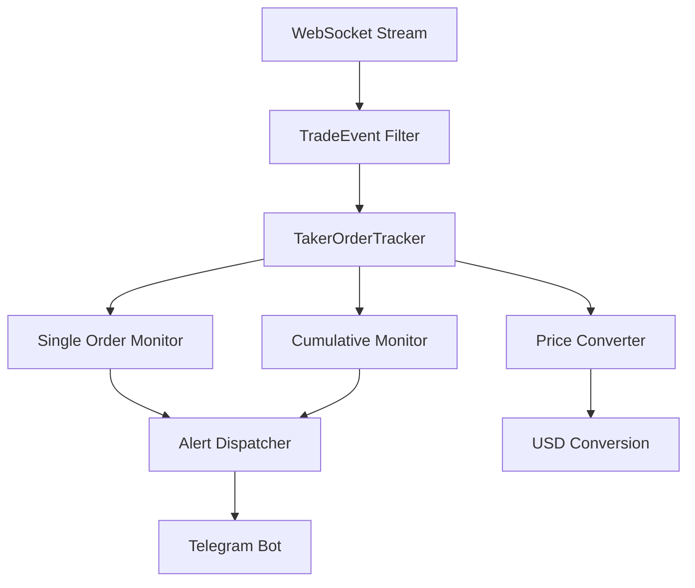
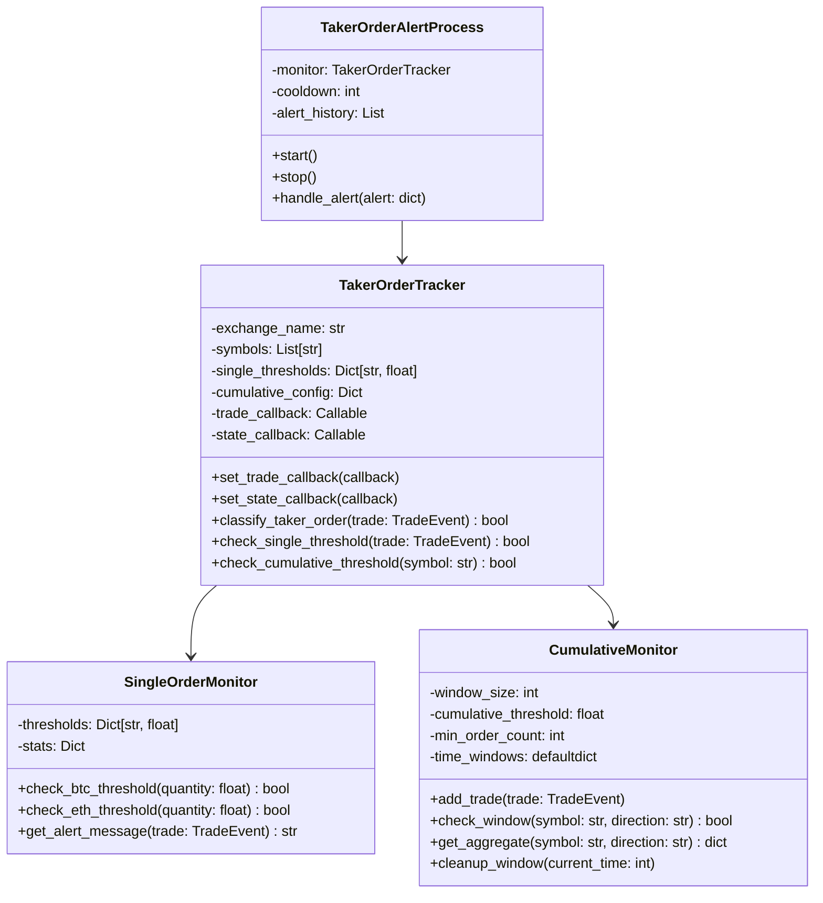
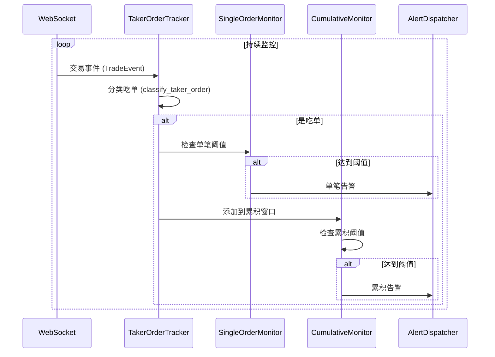
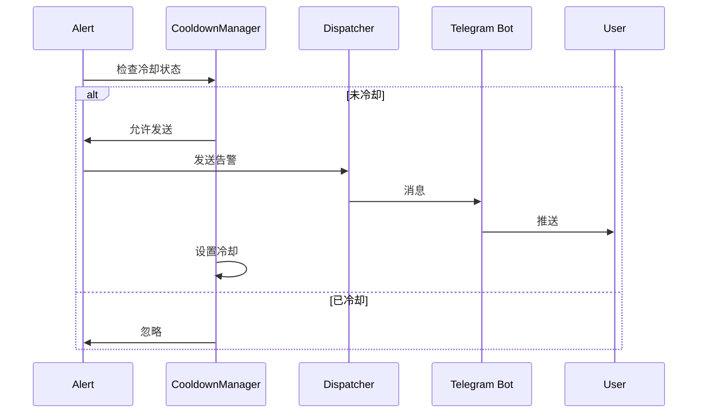

# OpenSpec 技术规范：4.3.4 吃单监控

## 📋 规范信息

**规范编号**: SPEC-2025-0105
**版本**: v1.0.0
**创建日期**: 2025-11-09
**状态**: 草案 (Draft)
**适用范围**: 所有开发者、测试人员、运维人员

---

## 🎯 规范目的

定义吃单监控系统的技术实现细节，确保系统能够：
- 实时监控 BTC/ETH 单笔大额吃单订单
- 检测 1 分钟内累积吃单活动
- 准确区分吃单和挂单
- 提供及时、准确的告警通知

---

## 📦 依赖规范

### 现有组件
- 大额订单监控系统 (`src/monitor/large_orders/`)
- WebSocket 客户端 (`src/monitor/large_orders/exchanges/binance.py`)
- 价格转换器 (`src/monitor/large_orders/src/price_converter.py`)
- 错误恢复机制 (`src/monitor/large_orders/src/error_recovery.py`)

### 外部依赖
- `websockets`: WebSocket 客户端库
- `asyncio`: 异步编程框架
- `json`: 数据序列化
- `datetime`: 时间处理
- `collections`: 数据结构 (deque, defaultdict)

---

## 🏗️ 架构设计

### 1. 整体架构



### 2. 核心类图



---

## 📊 数据模型

### 1. TradeEvent (扩展)

```python
@dataclass
class TradeEvent:
    """交易事件（扩展吃单标识）"""
    exchange: str
    symbol: str
    side: str  # BUY/SELL
    order_type: str
    price: float
    quantity: float
    amount: float
    trade_time: int
    is_taker: bool  # 新增：是否为吃单
    taker_rate: float  # 新增：吃单率
    trade_id: str
    raw_data: dict
```

### 2. TakerAlert

```python
@dataclass
class TakerAlert:
    """吃单告警"""
    alert_type: str  # SINGLE_ORDER / CUMULATIVE
    symbol: str
    direction: str  # BUY / SELL
    timestamp: int
    # 单笔告警
    quantity: float = None
    amount_usd: float = None
    # 累积告警
    order_count: int = None
    total_amount_usd: float = None
    avg_amount_usd: float = None
    time_range: tuple = None  # (start_time, end_time)
    # 告警控制
    cooldown_until: int = None
```

### 3. 配置文件

```python
# src/monitor/taker_orders/config.py
TAKER_CONFIG = {
    "single_thresholds": {
        "BTCUSDT": {
            "quantity": 50,  # BTC 数量
            "min_amount_usd": 2500000  # 最小 USD 金额
        },
        "ETHUSDT": {
            "quantity": 2000,  # ETH 数量
            "min_amount_usd": 4000000  # 最小 USD 金额
        }
    },
    "cumulative": {
        "window_size": 60,  # 1分钟窗口（秒）
        "threshold_usd": 1000000,  # $1M USD
        "min_order_count": 5,  # 最少订单数
        "directions": ["BUY", "SELL"]  # 监控方向
    },
    "cooldown": {
        "single_order": 60,  # 单笔告警冷却（秒）
        "cumulative": 300,   # 累积告警冷却（秒）
        "per_symbol": True   # 每交易对独立冷却
    }
}
```

---

## 🔌 接口定义

### 1. TakerOrderTracker

```python
class TakerOrderTracker:
    """吃单订单追踪器"""

    def __init__(
        self,
        exchange_name: str,
        symbols: List[str],
        config: Dict[str, Any]
    ):
        """初始化

        Args:
            exchange_name: 交易所名称
            symbols: 监控的交易对列表
            config: 配置文件
        """
        self.exchange_name = exchange_name
        self.symbols = symbols
        self.config = config
        self.single_thresholds = config["single_thresholds"]
        self.cumulative_config = config["cumulative"]
        self.cooldown_config = config["cooldown"]
        self.trade_callback = None
        self.state_callback = None

    def set_trade_callback(self, callback: Callable[[TakerAlert], None]):
        """设置交易回调函数"""
        self.trade_callback = callback

    def set_state_callback(self, callback: Callable[[str], None]):
        """设置状态回调函数"""
        self.state_callback = callback

    async def start(self):
        """启动监控"""
        pass

    async def stop(self):
        """停止监控"""
        pass

    def classify_taker_order(self, trade: TradeEvent) -> bool:
        """分类吃单

        判断交易是否为吃单（主动成交）

        Args:
            trade: 交易事件

        Returns:
            bool: True 表示为吃单

        算法：
        1. 计算买单深度变化
        2. 计算卖单深度变化
        3. 判断是否为深度移除
        4. 吃单率 > 0.5 认为是吃单
        """
        # 简化实现：基于 is_taker 字段
        return trade.is_taker

    def check_single_threshold(self, trade: TradeEvent) -> bool:
        """检查单笔订单阈值

        Args:
            trade: 交易事件

        Returns:
            bool: 是否达到阈值
        """
        symbol = trade.symbol
        if symbol not in self.single_thresholds:
            return False

        threshold = self.single_thresholds[symbol]
        quantity = trade.quantity

        if symbol == "BTCUSDT":
            return quantity >= threshold["quantity"]
        elif symbol == "ETHUSDT":
            return quantity >= threshold["quantity"]

        return False

    def check_cumulative_threshold(
        self,
        symbol: str,
        direction: str,
        current_time: int
    ) -> Tuple[bool, Optional[Dict]]:
        """检查累积阈值

        Args:
            symbol: 交易对
            direction: 方向 (BUY/SELL)
            current_time: 当前时间戳

        Returns:
            Tuple[bool, Optional[Dict]]: (是否达到阈值, 聚合数据)
        """
        window_size = self.cumulative_config["window_size"]
        threshold_usd = self.cumulative_config["threshold_usd"]
        min_order_count = self.cumulative_config["min_order_count"]

        # 获取时间窗口内的交易
        window_key = f"{symbol}_{direction}"
        trades = self._get_window_trades(window_key, current_time)

        # 过滤吃单
        taker_trades = [t for t in trades if self.classify_taker_order(t)]

        # 检查订单数量
        if len(taker_trades) < min_order_count:
            return False, None

        # 计算总金额
        total_amount_usd = sum(self._convert_to_usd(t) for t in taker_trades)

        # 检查金额阈值
        if total_amount_usd < threshold_usd:
            return False, None

        # 返回聚合数据
        avg_amount = total_amount_usd / len(taker_trades)
        return True, {
            "order_count": len(taker_trades),
            "total_amount_usd": total_amount_usd,
            "avg_amount_usd": avg_amount,
            "start_time": current_time - window_size,
            "end_time": current_time
        }

    def _convert_to_usd(self, trade: TradeEvent) -> float:
        """转换为 USD 金额"""
        # 复用价格转换器
        # 实现细节...
        return trade.amount

    def _get_window_trades(
        self,
        window_key: str,
        current_time: int
    ) -> List[TradeEvent]:
        """获取时间窗口内的交易"""
        # 实现滚动窗口
        # 返回指定窗口内的交易列表
        pass
```

### 2. SingleOrderMonitor

```python
class SingleOrderMonitor:
    """单笔订单监控器"""

    def __init__(self, thresholds: Dict[str, Dict]):
        self.thresholds = thresholds
        self.stats = {
            "single_order_alerts": 0,
            "btc_alerts": 0,
            "eth_alerts": 0
        }

    def check_btc_threshold(self, quantity: float) -> bool:
        """检查 BTC 阈值"""
        return quantity >= self.thresholds["BTCUSDT"]["quantity"]

    def check_eth_threshold(self, quantity: float) -> bool:
        """检查 ETH 阈值"""
        return quantity >= self.thresholds["ETHUSDT"]["quantity"]

    def get_alert_message(self, trade: TradeEvent) -> str:
        """生成告警消息"""
        symbol = trade.symbol
        direction = "主动买入" if trade.side == "BUY" else "主动卖出"

        if symbol == "BTCUSDT":
            return (
                f"[吃单监控] {symbol}\n"
                f"单笔大额吃单告警！\n"
                f"方向: {direction}\n"
                f"数量: {trade.quantity:.2f} BTC\n"
                f"金额: ${trade.amount:,.2f}\n"
                f"时间: {datetime.fromtimestamp(trade.trade_time/1000).strftime('%H:%M:%S')}"
            )
        elif symbol == "ETHUSDT":
            return (
                f"[吃单监控] {symbol}\n"
                f"单笔大额吃单告警！\n"
                f"方向: {direction}\n"
                f"数量: {trade.quantity:.0f} ETH\n"
                f"金额: ${trade.amount:,.2f}\n"
                f"时间: {datetime.fromtimestamp(trade.trade_time/1000).strftime('%H:%M:%S')}"
            )
```

### 3. CumulativeMonitor

```python
class CumulativeMonitor:
    """累积监控器"""

    def __init__(self, config: Dict[str, Any]):
        self.window_size = config["window_size"]
        self.threshold_usd = config["threshold_usd"]
        self.min_order_count = config["min_order_count"]
        self.time_windows = defaultdict(list)
        self.stats = {
            "cumulative_alerts": 0,
            "buy_alerts": 0,
            "sell_alerts": 0
        }

    def add_trade(self, trade: TradeEvent, is_taker: bool):
        """添加交易到窗口"""
        if not is_taker:
            return

        current_time = int(trade.trade_time / 1000)  # 转换为秒

        # 为每个方向创建窗口
        for direction in [trade.side]:
            window_key = f"{trade.symbol}_{direction}"
            self.time_windows[window_key].append({
                "trade": trade,
                "timestamp": current_time,
                "amount_usd": self._convert_to_usd(trade)
            })

        # 清理过期数据
        self.cleanup_windows(current_time)

    def cleanup_windows(self, current_time: int):
        """清理过期窗口数据"""
        cutoff_time = current_time - self.window_size

        for window_key in list(self.time_windows.keys()):
            trades = self.time_windows[window_key]
            # 保留窗口内的交易
            self.time_windows[window_key] = [
                t for t in trades
                if t["timestamp"] > cutoff_time
            ]
            # 删除空窗口
            if not self.time_windows[window_key]:
                del self.time_windows[window_key]

    def check_window(
        self,
        symbol: str,
        direction: str,
        current_time: int
    ) -> Tuple[bool, Optional[Dict]]:
        """检查窗口是否达到阈值"""
        window_key = f"{symbol}_{direction}"
        trades = self.time_windows.get(window_key, [])

        if len(trades) < self.min_order_count:
            return False, None

        # 计算总金额
        total_amount_usd = sum(t["amount_usd"] for t in trades)

        if total_amount_usd < self.threshold_usd:
            return False, None

        # 返回聚合数据
        avg_amount = total_amount_usd / len(trades)
        return True, {
            "order_count": len(trades),
            "total_amount_usd": total_amount_usd,
            "avg_amount_usd": avg_amount,
            "start_time": current_time - self.window_size,
            "end_time": current_time
        }

    def _convert_to_usd(self, trade: TradeEvent) -> float:
        """转换为 USD 金额"""
        # 使用价格转换器
        # 简化实现：直接返回 amount
        return trade.amount
```

### 4. TakerOrderAlertProcess

```python
class TakerOrderAlertProcess(BaseAlertProcess):
    """吃单告警处理进程"""

    def __init__(self, bot: "TelegramBot"):
        super().__init__()
        self.bot = bot
        self.config = load_config()["taker_order"]
        self.monitor = TakerOrderTracker(
            exchange_name="binance",
            symbols=["BTCUSDT", "ETHUSDT"],
            config=self.config
        )
        self.alert_history = []
        self.cooldowns = {}  # symbol -> timestamp

    def poll_user_alerts(self, tg_user_id: str) -> None:
        """轮询用户告警（此功能无轮询）"""
        pass

    def run(self):
        """运行监控"""
        # 启动 WebSocket 监控
        # 处理交易事件
        # 发送告警
        pass

    def handle_trade(self, trade: TradeEvent):
        """处理交易事件"""
        # 1. 检查是否为吃单
        is_taker = self.monitor.classify_taker_order(trade)

        # 2. 检查单笔阈值
        if self.monitor.check_single_threshold(trade):
            self._send_single_alert(trade)

        # 3. 检查累积阈值
        current_time = int(trade.trade_time / 1000)
        for direction in ["BUY", "SELL"]:
            triggered, data = self.monitor.check_cumulative_threshold(
                trade.symbol,
                direction,
                current_time
            )
            if triggered:
                self._send_cumulative_alert(trade.symbol, direction, data)

    def _send_single_alert(self, trade: TradeEvent):
        """发送单笔告警"""
        symbol = trade.symbol

        # 检查冷却
        if self._is_in_cooldown(symbol, "single"):
            return

        # 生成告警
        alert = TakerAlert(
            alert_type="SINGLE_ORDER",
            symbol=symbol,
            direction=trade.side,
            timestamp=trade.trade_time,
            quantity=trade.quantity,
            amount_usd=self._convert_to_usd(trade)
        )

        # 发送告警
        self._dispatch_alert(alert)

        # 设置冷却
        self._set_cooldown(symbol, "single")

    def _send_cumulative_alert(
        self,
        symbol: str,
        direction: str,
        data: Dict
    ):
        """发送累积告警"""
        # 检查冷却
        key = f"{symbol}_{direction}"
        if self._is_in_cooldown(key, "cumulative"):
            return

        # 生成告警
        alert = TakerAlert(
            alert_type="CUMULATIVE",
            symbol=symbol,
            direction=direction,
            timestamp=datetime.now().timestamp() * 1000,
            order_count=data["order_count"],
            total_amount_usd=data["total_amount_usd"],
            avg_amount_usd=data["avg_amount_usd"],
            time_range=(data["start_time"], data["end_time"])
        )

        # 发送告警
        self._dispatch_alert(alert)

        # 设置冷却
        self._set_cooldown(key, "cumulative")

    def _dispatch_alert(self, alert: TakerAlert):
        """分发告警"""
        # 生成消息
        message = self._format_message(alert)

        # 发送到所有白名单用户
        whitelist = self.bot.whitelist_db.get_all()
        for user_id in whitelist:
            try:
                self.bot.send_message(user_id, message)
            except Exception as e:
                logger.error(f"Failed to send alert to {user_id}: {e}")

        # 记录告警历史
        self.alert_history.append(alert)

    def _format_message(self, alert: TakerAlert) -> str:
        """格式化告警消息"""
        if alert.alert_type == "SINGLE_ORDER":
            direction = "主动买入" if alert.direction == "BUY" else "主动卖出"
            symbol = alert.symbol

            if symbol == "BTCUSDT":
                return (
                    f"🚨 [吃单监控] {symbol}\n"
                    f"━━━━━━━━━━━━━━━━━━\n"
                    f"📊 单笔大额吃单告警！\n"
                    f"🔄 方向: {direction}\n"
                    f"💰 数量: {alert.quantity:.2f} BTC\n"
                    f"💵 金额: ${alert.amount_usd:,.2f}\n"
                    f"⏰ 时间: {datetime.fromtimestamp(alert.timestamp/1000).strftime('%H:%M:%S')}"
                )
            else:  # ETHUSDT
                return (
                    f"🚨 [吃单监控] {symbol}\n"
                    f"━━━━━━━━━━━━━━━━━━\n"
                    f"📊 单笔大额吃单告警！\n"
                    f"🔄 方向: {direction}\n"
                    f"💰 数量: {alert.quantity:.0f} ETH\n"
                    f"💵 金额: ${alert.amount_usd:,.2f}\n"
                    f"⏰ 时间: {datetime.fromtimestamp(alert.timestamp/1000).strftime('%H:%M:%S')}"
                )

        else:  # CUMULATIVE
            direction = "主动买入" if alert.direction == "BUY" else "主动卖出"
            start_time = datetime.fromtimestamp(alert.time_range[0]).strftime('%H:%M:%S')
            end_time = datetime.fromtimestamp(alert.time_range[1]).strftime('%H:%M:%S')

            return (
                f"⚡ [吃单监控] {alert.symbol}\n"
                f"━━━━━━━━━━━━━━━━━━\n"
                f"📈 累积吃单活动告警！\n"
                f"⏱️  时间范围: {start_time}-{end_time} (60秒)\n"
                f"🔄 方向: {direction}\n"
                f"📊 订单数: {alert.order_count}笔\n"
                f"💰 总金额: ${alert.total_amount_usd:,.2f}\n"
                f"📉 平均金额: ${alert.avg_amount_usd:,.2f}"
            )
```

---

## 🔄 流程定义

### 1. 监控流程



### 2. 告警流程



---

## ⚙️ 配置规范

### 1. 配置文件结构

```yaml
# config/taker_order.yaml
taker_order:
  enabled: true

  # 单笔订单阈值
  single_thresholds:
    BTCUSDT:
      quantity: 50  # BTC 数量
      min_amount_usd: 2500000  # 最小 USD 金额
    ETHUSDT:
      quantity: 2000  # ETH 数量
      min_amount_usd: 4000000  # 最小 USD 金额

  # 累积监控
  cumulative:
    window_size: 60  # 窗口大小（秒）
    threshold_usd: 1000000  # 阈值（USD）
    min_order_count: 5  # 最少订单数

  # 冷却配置
  cooldown:
    single_order: 60  # 单笔告警冷却（秒）
    cumulative: 300   # 累积告警冷却（秒）
    per_symbol: true  # 每交易对独立冷却

  # WebSocket 配置
  websocket:
    reconnect_attempts: 5
    reconnect_delay: 5
    ping_interval: 20
    ping_timeout: 10
```

---

## 🧪 测试规范

### 1. 单元测试

```python
# tests/test_taker_order_monitor/test_tracker.py
import pytest
from src.monitor.taker_orders.src.tracker import TakerOrderTracker

class TestTakerOrderTracker:
    def test_classify_taker_order(self):
        """测试吃单分类"""
        tracker = TakerOrderTracker(...)
        trade = create_test_trade(is_taker=True)
        assert tracker.classify_taker_order(trade) is True

    def test_check_btc_threshold(self):
        """测试 BTC 阈值检测"""
        tracker = TakerOrderTracker(...)
        trade = create_btc_trade(quantity=50)
        assert tracker.check_single_threshold(trade) is True

    def test_check_eth_threshold(self):
        """测试 ETH 阈值检测"""
        tracker = TakerOrderTracker(...)
        trade = create_eth_trade(quantity=2000)
        assert tracker.check_single_threshold(trade) is True

    @pytest.mark.asyncio
    async def test_cumulative_monitoring(self):
        """测试累积监控"""
        tracker = TakerOrderTracker(...)
        # 模拟多笔交易
        # 验证累积检测
        pass
```

### 2. 集成测试

```python
# tests/test_taker_order_monitor/test_integration.py
class TestTakerOrderIntegration:
    @pytest.mark.asyncio
    async def test_full_workflow(self):
        """测试完整工作流"""
        # 启动监控
        # 发送测试交易
        # 验证告警
        pass

    @pytest.mark.asyncio
    async def test_cooldown_mechanism(self):
        """测试冷却机制"""
        # 发送第一笔告警
        # 立即发送第二笔相同交易
        # 验证冷却生效
        pass
```

---

## 📈 性能规范

### 1. 性能指标

| 指标 | 目标值 | 测量方法 |
|------|--------|---------|
| 数据处理延迟 | < 200ms | 交易事件到告警的时间 |
| 告警生成延迟 | < 500ms | 阈值触发到消息生成 |
| WebSocket 延迟 | < 100ms | 数据接收延迟 |
| CPU 使用率 | < 5% | 持续监控平均值 |
| 内存使用 | < 200MB | 运行时内存占用 |
| 吞吐量 | > 1000 trades/秒 | 单个实例处理能力 |

### 2. 性能优化

- **异步处理**: 所有 I/O 操作使用 async/await
- **批量处理**: 累积分析批量处理
- **内存管理**: 滚动窗口自动清理
- **连接复用**: WebSocket 连接池
- **缓存机制**: USD 转换结果缓存

---

## 🔒 安全规范

### 1. 数据安全
- 不存储敏感交易数据
- 告警历史定期清理（7天）
- 用户数据加密存储

### 2. 访问控制
- 白名单用户才能接收告警
- 管理员命令权限验证
- API 访问速率限制

### 3. 错误处理
- WebSocket 断开自动重连
- API 错误指数退避
- 告警发送失败重试

---

## 🚀 部署规范

### 1. 环境要求
- Python 3.8+
- 内存: 512MB+
- 网络: 稳定的互联网连接

### 2. 依赖安装
```bash
pip install websockets asyncio
```

### 3. 启动方式
```python
# __main__.py
from src.alert_processes.taker_order import TakerOrderAlertProcess

# 启动吃单监控
taker_process = TakerOrderAlertProcess(bot)
taker_process.start()
```

---

## 📚 参考文档

- [Binance WebSocket API](https://binance-docs.github.io/apidocs/spot/en/#trade-streams)
- [WebSocket 客户端库](https://websockets.readthedocs.io/)
- [Python asyncio 指南](https://docs.python.org/3/library/asyncio.html)
- [项目架构文档](../large-order-monitoring/README.md)

---

*本规范基于 OpenSpec 规范驱动开发方法制定*
