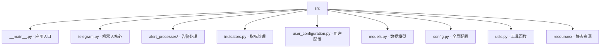
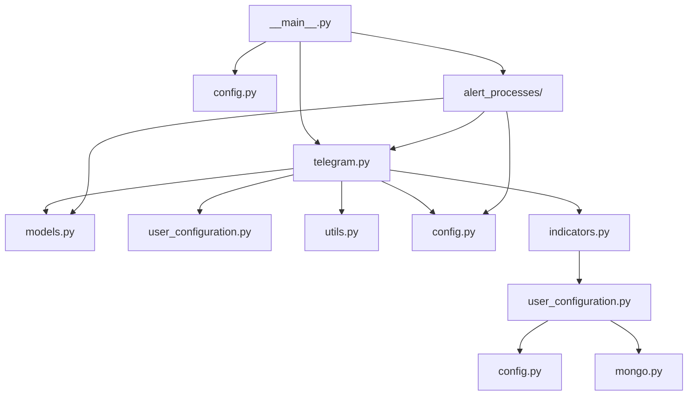

# /src 模块文档

> **导航**: [根目录](../) | 本模块 | [alert_processes](./alert_processes/) | [resources](./resources/)

---

## 📦 模块概览

主源码目录，包含 Telegram 加密货币告警机器人的所有核心组件。



---

## 🔧 核心文件详解

### 1. 应用生命周期 (`__main__.py`)

**职责**: 应用主入口，负责初始化和线程协调

**关键流程**:
```python
# 1. 环境变量处理 (line 14-15)
handle_env()

# 2. 初始设置 (line 18-21)
if len(get_whitelist()) == 0:
    do_setup()
    sleep(5)

# 3. 组件初始化 (line 23-48)
taapiio_process = TaapiioProcess(...)
telegram_bot = TelegramBot(...)
CEXAlertProcess(...)
TaapiioProcess(...)
TechnicalAlertProcess(...)

# 4. 主线程守护 (line 52-57)
while True:
    sleep(0.5)
    except KeyboardInterrupt
```

**设计亮点**:
- ✅ 守护线程模式，避免主进程阻塞
- ✅ 优雅关闭机制
- ✅ 组件解耦，独立初始化

---

### 2. Telegram 机器人 (`telegram.py`)

**职责**: 处理用户交互、命令解析、消息发送

**继承关系**:
```python
class TelegramBot(TeleBot):
    # 继承 pyTelegramBotAPI 的 TeleBot
```

**核心方法**:
- `on_id(message)`: 返回用户 Telegram ID
- `on_help(message)`: 帮助命令
- `on_new_alert(message)`: 创建新告警 ⭐
- `on_list_alerts(message)`: 列出用户告警
- `on_delete_alert(message)`: 删除告警
- `on_alerts_cooldown(message)`: 设置告警冷却

**命令处理示例**:
```python
# 简单价格告警 (line 74-80)
indicator = msg[1].upper()
if indicator in simple_indicators:
    pair, indicator, comparison, target = msg[0], msg[1], msg[2], msg[3]
    # 解析简单指标

# 技术指标告警 (line 81-100)
elif indicator in technical_indicators:
    # 验证 Taapi.io 配置
    # 解析参数
    # 验证指标格式
```

**设计亮点**:
- ✅ 装饰器模式（`@is_whitelisted`）
- ✅ 命令统一注册（`set_my_commands`）
- ✅ 多态告警处理（简单/技术指标）

---

### 3. 数据模型 (`models.py`)

**职责**: 定义核心数据结构

#### TechnicalAlert (line 5-17)
```python
@dataclass
class TechnicalAlert:
    pair: str              # 交易对
    indicator: str         # 指标名称
    interval: str          # 时间框架
    params: dict           # 指标参数
    output_vals: list      # 输出值
    endpoint: str          # API 端点
    name: str              # 指标显示名
    type: str = "t"        # 告警类型 (技术指标)
```

#### CEXAlert (line 20-30)
```python
@dataclass
class CEXAlert:
    pair: str              # 交易对
    indicator: str         # 指标类型
    params: dict = None    # 指标参数
    type: str = "s"        # 告警类型 (简单价格)
```

#### BinancePriceResponse (line 32-78)
币安价格响应数据模型，包含 20+ 个字段：
- `symbol, priceChange, priceChangePercent`
- `weightedAvgPrice, openPrice, highPrice, lowPrice, lastPrice`
- `volume, quoteVolume`
- `openTime, closeTime`
- `window, location`

**设计亮点**:
- ✅ 使用 `@dataclass` 简化代码
- ✅ 明确的数据类型
- ✅ 完整的字段覆盖

---

### 4. 全局配置 (`config.py`)

**职责**: 集中管理所有配置常量

#### 告警配置 (line 5-10)
```python
CEX_POLLING_PERIOD = 10         # CEX 轮询周期 (秒)
TECHNICAL_POLLING_PERIOD = 5    # 技术指标轮询周期
OUTPUT_VALUE_PRECISION = 3      # 输出值精度
SIMPLE_INDICATORS = ["PRICE"]   # 简单指标列表
```

#### Telegram 配置 (line 12-15)
```python
MAX_ALERTS_PER_USER = 10  # 每用户最大告警数
```

#### Binance API 配置 (line 17-23)
```python
BINANCE_LOCATIONS = ["us", "global"]
BINANCE_PRICE_URL_GLOBAL = "..."
BINANCE_PRICE_URL_US = "..."
BINANCE_TIMEFRAMES = ["1m", "5m", ..., "1d", "7d"]
```

#### Taapi.io 配置 (line 37-48)
```python
SUBSCRIPTION_TIERS = {
    "free": (1, 20),    # 每20秒1个请求
    "basic": (5, 15),   # 每15秒5个请求
    "pro": (30, 15),
    "expert": (75, 15),
}
REQUEST_BUFFER = 0.05  # 5% 缓冲，防止速率限制
```

**设计亮点**:
- ✅ 集中配置管理
- ✅ 订阅等级动态控制
- ✅ 速率限制预防机制

---

### 5. 用户配置管理 (`user_configuration.py`)

**职责**: 存储和管理用户告警配置

#### 存储策略
```python
# 本地存储
class LocalUserConfiguration:
    def __init__(self):
        self.base_path = join(WHITELIST_ROOT, "users")

# MongoDB 存储 (可选)
class MongoDBUserConfiguration:
    def __init__(self):
        self.client = pymongo.MongoClient(MONGO_URI)
        self.db = self.client[MONGO_DB]
```

#### 核心功能
- `save_alert(user_id, alert)`: 保存告警
- `delete_alert(user_id, alert_name)`: 删除告警
- `get_user_alerts(user_id)`: 获取用户告警
- `get_whitelist()`: 获取白名单

**设计亮点**:
- ✅ 策略模式实现可插拔存储
- ✅ 白名单机制
- ✅ 自动目录创建

---

### 6. 技术指标系统 (`indicators.py`)

**职责**: 管理 Taapi.io API 调用和指标数据

#### TaapiioProcess 类
```python
class TaapiioProcess:
    def __init__(self, taapiio_apikey: str):
        self.api_key = taapiio_apikey
        self.rate_limiter = RateLimiter(...)
        self.aggregate = {}  # 缓存聚合数据
```

#### 核心方法
- `construct_bulk_url(exchange, symbol, interval)`: 构建批量请求
- `fetch_bulk(exchange, symbol, intervals)`: 批量获取数据 ⭐
- `handle_ta_response(data)`: 处理 API 响应

#### TADatabaseClient 类
- `fetch_ref()`: 获取指标参考数据
- `get_indicators()`: 获取可用指标列表

**设计亮点**:
- ✅ 批量请求减少 API 调用
- ✅ 速率限制保护
- ✅ 缓存机制

---

### 7. MongoDB 集成 (`mongo.py`)

**职责**: 可选的 MongoDB 数据库支持

**功能**:
- 数据库连接管理
- 集合操作封装
- 错误处理和重连

**使用条件**:
```python
# config.py:29
USE_MONGO_DB = False  # 切换到 MongoDB
```

---

### 8. 工具函数 (`utils.py`)

**职责**: 提供通用工具函数

#### 核心功能
```python
def handle_env():                    # 处理环境变量
def get_logfile() -> str:            # 获取日志文件路径
def get_help_command() -> str:       # 获取帮助文本
def get_commands() -> dict:          # 获取命令列表
def get_binance_price_url() -> str:  # 获取 Binance URL
def parse_trigger_cooldown(...)      # 解析冷却时间
```

**设计亮点**:
- ✅ 统一工具接口
- ✅ 文件路径处理
- ✅ 环境变量管理

---

### 9. 日志系统 (`logger.py`)

**职责**: 统一的日志记录系统

**配置**:
```python
logger = logging.getLogger("crypto-alert-bot")
handler = logging.FileHandler("bot.log")
formatter = logging.Formatter(...)
```

**输出**:
- 文件: `bot.log`
- 控制台: INFO 级别
- 格式: `%(asctime)s - %(name)s - %(levelname)s - %(message)s`

---

### 10. 初始设置 (`setup.py`)

**职责**: 引导用户完成初始配置

**流程**:
```python
def do_setup():
    # 1. 欢迎消息
    # 2. 收集 Telegram Bot Token
    # 3. 可选：收集 Taapi.io API Key
    # 4. 生成白名单文件
    # 5. 完成提示
```

---

## 📊 模块间依赖关系



---

## 🔌 外部依赖

| 依赖 | 用途 | 版本 |
|------|------|------|
| `telebot` | Telegram Bot API | 最新 |
| `requests` | HTTP 请求 | 最新 |
| `pymongo` | MongoDB 客户端 | 最新 |
| `python-dotenv` | 环境变量 | 最新 |
| `ratelimit` | 速率限制 | 最新 |

---

## 🎯 扩展指南

### 添加新告警类型

1. **创建告警处理器**:
```python
# src/alert_processes/your_type.py
class YourAlertProcess(BaseAlertProcess):
    def poll_user_alerts(self, tg_user_id: str) -> None:
        # 实现逻辑
        pass
```

2. **注册命令**:
```python
# src/telegram.py:46-50
user_commands = [
    # ... 添加新命令
]
```

3. **启动线程**:
```python
# src/__main__.py
threading.Thread(target=YourAlertProcess(...).run, daemon=True).start()
```

### 添加新交易所

1. **更新配置**:
```python
# src/config.py
NEW_EXCHANGE_TIMEFRAMES = [...]
NEW_EXCHANGE_PRICE_URL = "..."
```

2. **扩展数据模型**:
```python
# src/models.py
class NewExchangePriceResponse:
    # 实现数据结构
    pass
```

3. **实现解析逻辑**:
```python
# src/utils.py
def parse_new_exchange_price(data: dict):
    # 实现解析
    pass
```

---

## 📈 性能优化建议

### 1. 当前瓶颈
- **Taapi.io API**: 受订阅等级限制
- **轮询频率**: 可能产生过度请求
- **文件存储**: I/O 性能有限

### 2. 优化方向
- 实现 Redis 缓存层
- 添加请求去重机制
- 考虑消息队列解耦

---

## 🧪 测试策略

### 单元测试
```python
# tests/test_models.py
def test_technical_alert_creation():
    alert = TechnicalAlert(
        pair="BTC/USDT",
        indicator="RSI",
        ...
    )
    assert alert.type == "t"

# tests/test_telegram.py
def test_parse_simple_indicator_message():
    # 测试命令解析
    pass
```

### 集成测试
```python
# tests/test_integration.py
def test_full_alert_flow():
    # 模拟完整告警流程
    pass
```

### Mock 测试
```python
# 使用 unittest.mock
@patch('src.indicators.TaapiioProcess.fetch_bulk')
def test_bulk_fetch(mock_fetch):
    # 模拟 API 响应
    pass
```

---

## 🚨 异常处理

### 当前实践
- 基础异常捕获（`try/except`）
- API 调用失败日志记录
- 告警链路中的容错机制

### 待改进
- 更细粒度的异常分类
- 指数退避重试机制
- 死信队列处理

---

## 🔐 安全注意事项

### 1. 凭据管理
- ✅ 使用环境变量存储敏感信息
- ✅ `.env.example` 模板
- ❌ 避免硬编码密钥

### 2. 访问控制
- ✅ 白名单机制
- ✅ 用户配额限制
- ❌ 缺少验证码保护

### 3. 数据验证
- ✅ 参数格式验证
- ✅ 交易对白名单
- ❌ 输入长度限制

---

## 📝 代码规范

### 命名约定
- 类名: `PascalCase` (如 `TelegramBot`)
- 函数名: `snake_case` (如 `get_whitelist`)
- 常量: `UPPER_SNAKE_CASE` (如 `MAX_ALERTS_PER_USER`)
- 私有成员: `_single_leading_underscore`

### 文档约定
- 使用 Google 风格 docstring
- 所有公共方法必须有文档字符串
- 复杂逻辑添加行内注释

### 格式规范
- 使用 `black` 格式化
- 最大行长度: 88 字符
- 类型提示: 推荐使用

---

## 🔄 版本升级指南

### v3.x → v4.x 计划

#### 架构改进
- [ ] 引入 asyncio 异步支持
- [ ] 重构为微服务架构
- [ ] 添加 Web 管理界面

#### 功能扩展
- [ ] 支持 50+ 交易所
- [ ] 自定义指标编写
- [ ] 社区告警共享

#### 性能提升
- [ ] Redis 缓存层
- [ ] 数据库连接池
- [ ] 消息队列解耦

---

*Generated with Claude Code - 2025-11-08*
