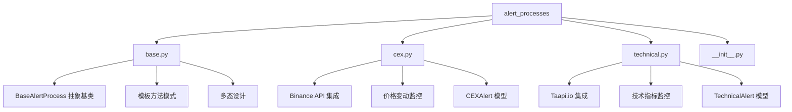
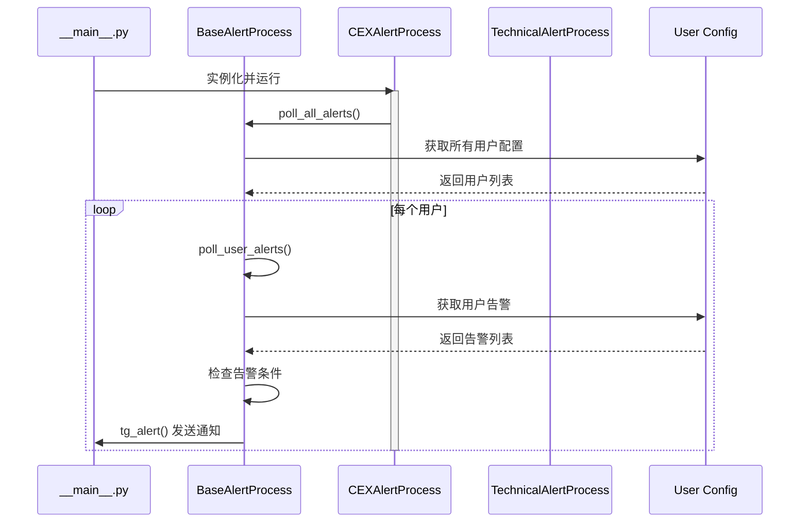

# /src/alert_processes 模块文档

> **导航**: [根目录](../) | [本模块](./) | [base.py](./base.py) | [cex.py](./cex.py) | [technical.py](./technical.py)

---

## 📦 模块概览

告警处理器核心模块，实现不同类型告警的监控和触发逻辑。



---

## 🏗️ 架构设计

### 核心模式: 模板方法 + 多态

**设计思路**:
1. **抽象基类** (`BaseAlertProcess`): 定义统一接口
2. **具体实现** (`CEXAlertProcess`, `TechnicalAlertProcess`): 实现特定逻辑
3. **多态调用**: 主程序无需关心具体类型



---

## 📄 文件详解

### 1. 抽象基类 (`base.py`)

**职责**: 定义告警处理器的标准接口

#### 核心方法

**poll_user_alerts (line 18-28)**
```python
@abstractmethod
def poll_user_alerts(self, tg_user_id: str) -> None:
    """
    轮询单个用户的告警
    流程:
    1. 加载用户配置
    2. 轮询告警并创建消息
    3. 清理告警条件
    4. 发送告警通知
    """
```

**poll_all_alerts (line 30-39)**
```python
@abstractmethod
def poll_all_alerts(self):
    """
    轮询所有用户的告警
    流程:
    1. 聚合所有用户的资产
    2. 获取所有资产价格/指标
    3. 记录单个用户失败日志
    """
```

**tg_alert (line 41-49)**
```python
@abstractmethod
def tg_alert(self, post: str, channel_ids: list[str], pair: str):
    """
    发送 Telegram 告警
    每个告警处理器需要自己的实现
    因为输出格式因资产/告警类型而异
    """
```

**run (line 51-58)**
```python
@abstractmethod
def run(self):
    """
    在循环中运行告警处理器
    应该在新的守护线程中启动
    """
```

#### 设计优势
- ✅ **标准化接口**: 所有告警处理器遵循相同协议
- ✅ **多态性**: 运行时动态选择具体实现
- ✅ **可扩展性**: 添加新告警类型无需修改现有代码

---

### 2. CEX 告警处理器 (`cex.py`)

**职责**: 监控中心化交易所（主要是 Binance）价格变动

#### 类结构
```python
class CEXAlertProcess(BaseAlertProcess):
    def __init__(self, telegram_bot: TelegramBot):
        super().__init__(telegram_bot)
        self.symbols = set()      # 监控的交易对
        self.symbol_user_map = {} # 交易对到用户映射
```

#### 核心方法解析

**run (line 57-66)**
```python
def run(self):
    while True:
        self.poll_all_alerts()
        sleep(CEX_POLLING_PERIOD)  # 10秒间隔
```
- 主循环：持续监控
- 轮询间隔：10秒（`config.py:6`）

**poll_all_alerts (line 68-89)**
```python
def poll_all_alerts(self):
    # 1. 聚合所有用户的监控交易对
    self.symbols, self.symbol_user_map = self._aggregate_user_symbols()

    # 2. 并发获取所有交易对价格
    threads = [threading.Thread(target=self._fetch_price, args=(symbol,)) for symbol in self.symbols]
    for thread in threads: thread.start()
    for thread in threads: thread.join()
```
- **聚合优化**: 避免重复请求
- **并发获取**: 提升性能
- **线程管理**: 显式 join 等待

**_aggregate_user_symbols (line 91-111)**
```python
def _aggregate_user_symbols(self):
    symbols = set()
    symbol_user_map = {}
    for user_id in get_whitelist():
        alerts = BaseConfig(user_id).get_user_alerts(type="s")  # 只获取简单告警
        for alert in alerts:
            symbols.add(alert.pair)
            if alert.pair not in symbol_user_map:
                symbol_user_map[alert.pair] = []
            symbol_user_map[alert.pair].append(user_id)
    return symbols, symbol_user_map
```
- **按类型过滤**: `type="s"` 仅获取简单告警
- **映射构建**: 快速查找交易对所属用户

**_fetch_price (line 113-143)**
```python
def _fetch_price(self, symbol: str):
    # 1. 获取价格数据 (Binance/Binance US)
    # 2. 解析响应
    # 3. 检查所有相关用户的告警条件
    # 4. 触发符合条件的告警
```
- 支持多地区：Global + US
- 错误处理：网络异常容错
- 动态检查：每个用户条件独立

**check_price_alert (line 145-204)**
```python
def check_price_alert(self, alert: CEXAlert, price_data: BinancePriceResponse, user_id: str):
    """
    检查价格告警条件
    支持:
    - ABOVE: 价格高于目标值
    - BELOW: 价格低于目标值
    - PCTCHG: 百分比变化
    - 24HRCHG: 24小时变化
    """
```
- **多条件支持**: 4 种比较类型
- **数据完整**: 使用 `BinancePriceResponse` 模型
- **用户隔离**: 每个用户独立检查

**tg_alert (line 206-235)**
```python
def tg_alert(self, post: str, channel_ids: list[str], pair: str):
    # 格式化告警消息
    # 添加表情符号和格式化
    # 发送至 Telegram
```
- **消息格式化**: 友好的用户界面
- **表情符号**: 可视化增强
- **防 Spam**: 冷静期机制

#### 性能优化

**1. 并发请求 (line 79)**
```python
threads = [threading.Thread(target=self._fetch_price, args=(symbol,)) for symbol in self.symbols]
```
- 避免串行等待
- 充分利用网络 I/O

**2. 聚合减少请求 (line 92)**
```python
symbols = set()  # 去重
symbol_user_map = {}  # 快速映射
```
- 同一交易对只请求一次
- 快速查找目标用户

**3. 线程安全 (line 81-84)**
```python
for thread in threads: thread.start()
for thread in threads: thread.join()
```
- 显式同步
- 确保数据完整性

---

### 3. 技术指标告警处理器 (`technical.py`)

**职责**: 监控技术指标（RSI、MACD、布林带等）

#### 类结构
```python
class TechnicalAlertProcess(BaseAlertProcess):
    def __init__(self, telegram_bot: TelegramBot):
        super().__init__(telegram_bot)
        self.taapiio_cli = telegram_bot.taapiio_cli
        self.indicators_db = telegram_bot.indicators_db
```

**注意**: 依赖 `telegram_bot.taapiio_cli`，无 API Key 时不初始化

#### 核心流程

**run (line 27-38)**
```python
def run(self):
    while True:
        if self.taapiio_cli is None:
            logger.error("Taapi.io 客户端未初始化")
            break
        self.poll_all_alerts()
        sleep(TECHNICAL_POLLING_PERIOD)  # 5秒间隔
```
- **依赖检查**: 确保 API 客户端可用
- **轮询间隔**: 5秒（更频繁）

**poll_all_alerts (line 40-72)**
```python
def poll_all_alerts(self):
    # 1. 聚合所有用户的技术指标告警
    # 2. 按 (symbol, interval) 分组聚合
    # 3. 批量获取指标数据
    # 4. 分发到各用户检查
```

**分组聚合 (line 74-90)**
```python
aggregated_indicators = {}
for user_id in get_whitelist():
    alerts = BaseConfig(user_id).get_user_alerts(type="t")  # 技术指标
    for alert in alerts:
        key = (alert.pair, alert.interval)
        if key not in aggregated_indicators:
            aggregated_indicators[key] = []
        aggregated_indicators[key].append((user_id, alert))
```
- **按类型过滤**: `type="t"`
- **二次聚合**: 按交易对+时间框架分组
- **最小化 API 调用**: 相同组合只请求一次

**批量获取 (line 92-122)**
```python
def fetch_ta_indicators(exchange, symbol, interval):
    # 1. 构建批量请求 URL
    # 2. 添加速率限制
    # 3. 发起 API 调用
    # 4. 解析响应
```
- **Taapi.io 聚合**: 一次请求多个指标
- **速率控制**: 遵守订阅限制
- **错误重试**: 网络异常处理

**检查指标条件 (line 124-179)**
```python
def check_technical_alert(self, alert: TechnicalAlert, ta_data: dict, user_id: str):
    """
    检查技术指标条件
    支持:
    - 数值比较: ABOVE, BELOW, EQUALS
    - 交叉信号: CROSS_UP, CROSS_DOWN
    - 区间判断: BETWEEN, OUTSIDE
    """
```

**支持的条件类型**:
- `ABOVE/BELOW`: 简单数值比较
- `CROSS_UP/DOWN`: 线交叉信号
- `EQUALS`: 精确匹配
- `BETWEEN/OUTSIDE`: 区间判断

---

## 🔄 轮询机制对比

| 处理器 | 轮询周期 | 数据源 | 优化策略 |
|--------|---------|-------|----------|
| **CEXAlertProcess** | 10秒 | Binance API | 并发获取、去重聚合 |
| **TechnicalAlertProcess** | 5秒 | Taapi.io | 批量请求、缓存 |

**为什么技术指标更频繁？**
- 用户更关注实时技术信号
- Taapi.io 支持批量请求，效率更高
- 市场变化快，需要及时响应

---

## 💡 设计模式深度解析

### 1. 模板方法模式 (base.py)

**结构**:
```
抽象基类 (BaseAlertProcess)
    ├─ 模板方法: poll_all_alerts()
    ├─ 抽象步骤: poll_user_alerts()      [子类实现]
    ├─ 抽象步骤: tg_alert()              [子类实现]
    └─ 抽象步骤: run()                   [子类实现]
```

**优势**:
- **代码复用**: 公共逻辑在基类
- **扩展性**: 新告警类型只需实现接口
- **一致性**: 所有处理器行为统一

### 2. 策略模式 (config.py)

**实现**:
```python
# 用户配置存储策略
BaseConfig = LocalUserConfiguration if not USE_MONGO_DB else MongoDBUserConfiguration
```

**优势**:
- **可插拔**: 轻松切换存储后端
- **无侵入**: 业务逻辑无需修改
- **解耦**: 存储与业务分离

### 3. 观察者模式 (telegram.py)

**实现**:
```python
@self.message_handler(commands=["new_alert"])
@self.is_whitelisted
def on_new_alert(message):
    # 事件处理
```

**优势**:
- **松耦合**: 事件与处理分离
- **可扩展**: 轻松添加新命令
- **职责清晰**: 每个命令独立处理

---

## 🚀 扩展新告警类型

### 步骤 1: 实现告警处理器
```python
# src/alert_processes/dex.py
from .base import BaseAlertProcess

class DEXAlertProcess(BaseAlertProcess):
    def __init__(self, telegram_bot: TelegramBot):
        super().__init__(telegram_bot)

    def poll_user_alerts(self, tg_user_id: str) -> None:
        # 1. 加载用户 DEX 告警
        # 2. 获取链上数据
        # 3. 检查条件
        # 4. 发送通知
        pass

    def run(self):
        while True:
            self.poll_all_alerts()
            sleep(15)  # 15秒间隔
```

### 步骤 2: 在 telegram.py 注册
```python
# src/telegram.py
@self.message_handler(commands=["new_dex_alert"])
@self.is_whitelisted
def on_new_dex_alert(message):
    # 解析 DEX 告警
    # 验证参数
    # 保存配置
    pass
```

### 步骤 3: 在 __main__.py 启动
```python
# src/__main__.py
if getenv("DEX_RPC_URL"):
    threading.Thread(
        target=DEXAlertProcess(telegram_bot=telegram_bot).run,
        daemon=True
    ).start()
```

---

## 🔧 性能优化建议

### 当前瓶颈
1. **CEX 并发限制**: 每次启动新线程
2. **Taapi.io 速率**: 受订阅等级约束
3. **轮询频率**: 可能过度请求

### 优化方案

#### 1. 连接池 (CEX)
```python
# 使用 requests.Session
self.session = requests.Session()
self.session.mount('https://', HTTPAdapter(pool_connections=20))

def _fetch_price(self, symbol: str):
    response = self.session.get(url, timeout=5)
```

#### 2. 缓存层 (技术指标)
```python
# Redis 缓存
import redis
self.redis = redis.Redis(host='localhost', port=6379, db=0)

def fetch_ta_indicators(self, key):
    cached = self.redis.get(key)
    if cached:
        return json.loads(cached)
    data = self._api_call()
    self.redis.setex(key, 300, json.dumps(data))  # 5分钟缓存
    return data
```

#### 3. 消息队列解耦
```python
# Celery 分布式任务
from celery import Celery
app = Celery('crypto-alerts')

@app.task
def check_alert(alert_id):
    # 异步检查告警
    pass

# 发送任务到队列
check_alert.delay(alert.id)
```

---

## 🧪 测试策略

### 单元测试
```python
# tests/test_cex_alert_process.py
def test_fetch_price_success():
    process = CEXAlertProcess(mock_telegram_bot)
    # Mock Binance API
    # 验证价格解析
    pass

def test_check_price_alert_above():
    alert = CEXAlert(pair="BTCUSDT", indicator="PRICE", ...)
    price_data = BinancePriceResponse({"lastPrice": 50000})
    # 验证 ABOVE 条件
    pass
```

### 集成测试
```python
# tests/test_integration.py
def test_full_alert_flow():
    # 1. 创建用户配置
    # 2. 设置告警
    # 3. 模拟价格触发
    # 4. 验证 Telegram 消息
    pass
```

### Mock 策略
```python
# 使用 pytest-mock
def test_poll_all_alerts(mocker):
    mocker.patch('src.user_configuration.get_whitelist', return_value=['user1'])
    mocker.patch('src.alert_processes.cex.CEXAlertProcess._fetch_price')
    # 测试轮询逻辑
    pass
```

---

## 📊 监控指标

### 关键指标
1. **告警触发率**: 每日触发的告警数量
2. **API 调用次数**: 各服务 API 使用量
3. **响应时间**: 价格/指标获取延迟
4. **错误率**: API 失败/超时比例
5. **用户活跃度**: 告警设置/删除频率

### 建议实现
```python
# 添加指标收集
from prometheus_client import Counter, Histogram

alert_triggers = Counter('alert_triggers_total', 'Total alert triggers', ['type', 'pair'])
api_duration = Histogram('api_request_duration_seconds', 'API request duration')
```

---

## 🐛 常见问题

### Q1: 告警不触发
**原因**:
- 条件过于严格
- API 数据延迟
- 轮询间隔过长

**排查**:
```python
# 1. 检查日志
logger.info(f"价格数据: {price_data.lastPrice}")
logger.info(f"告警条件: {alert.params}")

# 2. 验证时间框架
logger.info(f"时间框架: {interval}")

# 3. 检查速率限制
logger.warning("API 速率限制，跳过本次轮询")
```

### Q2: API 调用失败
**原因**:
- 网络连接问题
- API 端点变更
- 速率限制触发

**处理**:
```python
# 指数退避重试
for attempt in range(3):
    try:
        response = requests.get(url)
        break
    except RequestException as e:
        wait = 2 ** attempt
        sleep(wait)
```

### Q3: 内存泄漏
**原因**:
- 线程未正确结束
- 缓存无限增长
- 字典未清理

**预防**:
```python
# 定期清理
if len(self.symbols) > 1000:
    self.symbols.clear()
    self.symbol_user_map.clear()
```

---

## 🔐 安全考虑

### 1. 输入验证
```python
# 验证交易对格式
import re
def validate_pair(pair: str) -> bool:
    pattern = r'^[A-Z]{2,10}/[A-Z]{2,10}$'
    return bool(re.match(pattern, pair))
```

### 2. 限流保护
```python
# 防止 API 滥用
class RateLimiter:
    def __init__(self, calls: int, period: int):
        self.calls = calls
        self.period = period
        self.timestamp = time.time()
        self.count = 0
```

### 3. 白名单验证
```python
@decorator
def is_whitelisted(func, *args, **kwargs):
    user_id = args[0].from_user.id
    if user_id not in get_whitelist():
        raise PermissionError("User not whitelisted")
    return func(*args, **kwargs)
```

---

## 📈 路线图

### v4.0 计划
- [ ] **异步重构**: 使用 asyncio 提升性能
- [ ] **插件系统**: 支持第三方告警类型
- [ ] **可视化**: Web UI 管理界面
- [ ] **多链支持**: 集成 Ethereum、BSC 等

### v4.1 增强
- [ ] **机器学习**: 价格预测模型
- [ ] **社区功能**: 告警分享
- [ ] **移动端**: 原生 App
- [ ] **云服务**: SaaS 部署

---

*Generated with Claude Code - 2025-11-08*
