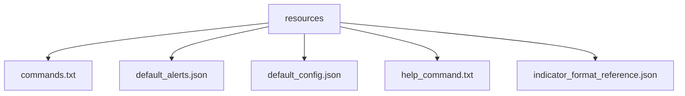

# /src/resources 模块文档

> **导航**: [根目录](../) | [src 目录](../) | 本模块

---

## 📦 模块概览

静态资源配置目录，包含默认值、帮助文档、命令列表和技术指标参考数据。



---

## 📄 文件详解

### 1. 命令列表 (`commands.txt`)

**格式**: 每行一个命令，制表符分隔 `命令<tab>描述`

**示例**:
```
id	显示您的 Telegram 用户 ID
new_alert	创建新的价格或技术指标告警
list_alerts	列出您的所有告警
delete_alert	删除指定的告警
alerts_cooldown	设置告警冷却时间（秒）
help	显示帮助信息
```

**用途**:
- **Telegram Bot 命令注册** (`telegram.py:44-50`):
```python
user_commands = [
    types.BotCommand(command=command, description=description)
    for command, description in get_commands().items()
]
self.set_my_commands(user_commands)
```

**设计优势**:
- ✅ **集中管理**: 所有命令在一个文件
- ✅ **易于维护**: 添加/修改命令无需改代码
- ✅ **多语言准备**: 可扩展为 i18n

---

### 2. 默认告警模板 (`default_alerts.json`)

**结构**:
```json
{
  "sample_alerts": [
    {
      "pair": "BTC/USDT",
      "indicator": "PRICE",
      "params": {
        "comparison": "ABOVE",
        "target": 50000
      }
    }
  ]
}
```

**用途**:
- 新用户引导
- 示例展示
- 批量导入

**使用场景**:
```python
# user_configuration.py
def create_sample_alerts(user_id: str):
    with open("resources/default_alerts.json") as f:
        samples = json.load(f)
    for alert in samples["sample_alerts"]:
        save_alert(user_id, alert)
```

---

### 3. 默认配置 (`default_config.json`)

**结构**:
```json
{
  "cooldown": 300
}
```

**用途**:
- 全局配置默认值
- 新安装引导
- 配置备份

**使用场景**:
```python
# telegram.py
default_cooldown = load_default_config()["cooldown"]
```

**设计思路**:
- 最小化配置项
- 仅存储必要的全局默认值
- 避免硬编码

---

### 4. 帮助命令文本 (`help_command.txt`)

**内容示例**:
```
欢迎使用加密货币告警机器人！

可用命令:
/id - 显示您的用户 ID
/new_alert - 创建新告警
/list_alerts - 查看您的告警
/delete_alert - 删除告警
/alerts_cooldown - 设置冷却时间
/help - 显示此帮助

支持的交易对:
- BTC/USDT, ETH/USDT, BNB/USDT 等
- 格式: BASE/QUOTE (如 BTC/USDT)

支持的指标:
- PRICE: 价格告警
- 24HRCHG: 24小时变化
- RSI, MACD, BB 等技术指标

示例:
/new_alert BTC/USDT PRICE ABOVE 50000
/new_alert ETH/USDT RSI 14 1h ABOVE 70
```

**用途**:
- `/help` 命令返回内容 (`telegram.py:60-63`)
- 用户引导和文档
- 快速参考

**展示效果**:
```python
@self.message_handler(commands=["help"])
@self.is_whitelisted
def on_help(message):
    self.reply_to(message, get_help_command())
```

**设计优势**:
- ✅ **即开即用**: 无需查看外部文档
- ✅ **统一格式**: 所有用户看到相同帮助
- ✅ **易本地化**: 可轻松翻译为多语言

---

### 5. 指标格式参考 (`indicator_format_reference.json`)

**结构** (节选):
```json
{
  "RSI": {
    "name": "Relative Strength Index",
    "params": {
      "period": {
        "type": "int",
        "min": 2,
        "max": 100,
        "default": 14,
        "description": "Period for RSI calculation"
      }
    },
    "output_values": [
      {
        "name": "value",
        "type": "float",
        "description": "RSI value (0-100)"
      }
    ],
    "intervals": ["1m", "5m", "15m", "30m", "1h", "2h", "4h", "12h", "1d", "1w"]
  },
  "MACD": {
    "name": "Moving Average Convergence Divergence",
    "params": {
      "fast_period": {...},
      "slow_period": {...},
      "signal_period": {...}
    },
    "output_values": [...]
  }
}
```

**用途**:
- **参数验证** (`telegram.py:96-100`):
```python
indicator_params = self.indicators_db[indicator]["params"]
# 验证用户输入的参数
```

- **动态表单生成**: Web UI 可根据此生成配置表单
- **API 文档**: 开发者参考
- **自动补全**: IDE 支持

**核心字段**:
- `name`: 指标全名
- `params`: 参数定义（类型、范围、默认值）
- `output_values`: 输出值定义
- `intervals`: 支持的时间框架

**使用示例**:
```python
# indicators.py: TADatabaseClient
def fetch_ref(self) -> dict:
    with open(TA_DB_PATH) as f:
        return json.load(f)

def get_indicator_schema(self, indicator: str) -> dict:
    return self.fetch_ref()[indicator]

def validate_params(self, indicator: str, params: dict) -> bool:
    schema = self.get_indicator_schema(indicator)
    # 验证 params 是否符合 schema
```

**支持的指标** (当前):
- **趋势指标**: EMA, SMA, MACD
- **震荡指标**: RSI, Stochastic, Williams %R
- **波动指标**: Bollinger Bands, ATR
- **量价指标**: OBV, Volume Profile
- **其他**: Ichimoku, Parabolic SAR, etc.

**数据来源**: Taapi.io 官方文档

---

## 🔄 文件加载机制

### 统一加载 (`utils.py`)

```python
def get_commands() -> dict:
    """从 commands.txt 加载命令列表"""
    commands = {}
    with open(join(RESOURCES_ROOT, "commands.txt")) as f:
        for line in f:
            if line.strip():
                parts = line.strip().split("\t")
                commands[parts[0]] = parts[1]
    return commands

def get_help_command() -> str:
    """从 help_command.txt 加载帮助文本"""
    with open(join(RESOURCES_ROOT, "help_command.txt")) as f:
        return f.read()
```

**设计优势**:
- ✅ **统一接口**: 所有资源文件通过 utils 加载
- ✅ **错误处理**: 文件不存在时优雅降级
- ✅ **缓存机制**: 避免重复 I/O

---

## 📊 使用统计

| 文件 | 读取频率 | 缓存 | 大小 |
|------|---------|------|------|
| commands.txt | 启动时 | 是 | < 1KB |
| help_command.txt | 每次调用 | 否 | ~2KB |
| default_alerts.json | 很少 | 是 | < 1KB |
| default_config.json | 很少 | 是 | < 1KB |
| indicator_reference.json | 启动时 | 是 | ~3KB |

**优化建议**:
- 小文件可以全部加载到内存
- 大文件（如历史数据）应实现缓存

---

## 🧪 测试策略

### 文件存在性测试
```python
# tests/test_resources.py
def test_all_resources_exist():
    resources_dir = "src/resources"
    required_files = [
        "commands.txt",
        "help_command.txt",
        "default_alerts.json",
        "default_config.json",
        "indicator_format_reference.json"
    ]
    for filename in required_files:
        assert exists(join(resources_dir, filename))
```

### JSON 格式验证
```python
def test_indicator_reference_valid_json():
    with open("src/resources/indicator_format_reference.json") as f:
        data = json.load(f)
    # 验证必需字段
    for indicator, schema in data.items():
        assert "name" in schema
        assert "params" in schema
        assert "intervals" in schema
```

### 命令格式验证
```python
def test_commands_format():
    commands = get_commands()
    for cmd, desc in commands.items():
        # 命令不应为空
        assert cmd
        assert desc
        # 命令格式验证
        assert cmd.startswith("/")
```

---

## 🔧 维护指南

### 添加新命令
1. **编辑 `commands.txt`**:
```
new_feature	新功能描述
```

2. **更新 `help_command.txt`**:
在帮助文本中添加说明和示例

3. **在 `telegram.py` 实现**:
```python
@self.message_handler(commands=["new_feature"])
@self.is_whitelisted
def on_new_feature(message):
    # 实现逻辑
    pass
```

### 添加新指标
1. **更新 `indicator_format_reference.json`**:
```json
{
  "NEWINDICATOR": {
    "name": "New Indicator Name",
    "params": {
      "param1": {
        "type": "int",
        "min": 1,
        "max": 100,
        "default": 14
      }
    },
    "output_values": [...],
    "intervals": ["1h", "4h", "1d"]
  }
}
```

2. **测试验证**:
```python
# 确保 Taapi.io 支持此指标
assert taapi.io indicator NEWINDICATOR exists
```

### 本地化支持 (未来)

**架构**:
```
resources/
  ├── commands.txt          # 默认英语
  ├── commands_zh.txt       # 中文
  ├── help_command.txt      # 默认英语
  ├── help_command_zh.txt   # 中文
  └── locales/
      ├── en/
      └── zh/
```

**实现**:
```python
def get_commands(locale: str = "en") -> dict:
    filename = f"commands_{locale}.txt" if locale != "en" else "commands.txt"
    with open(join(RESOURCES_ROOT, filename)) as f:
        return parse_commands(f)
```

---

## 📈 版本控制

### 资源文件版本管理
每个资源文件应包含版本信息:

```json
{
  "version": "1.0.0",
  "last_updated": "2025-11-08",
  "data": {...}
}
```

**版本号规则**:
- **主版本**: 不兼容变更
- **次版本**: 新增功能
- **修订版本**: 错误修复

**迁移脚本**:
```python
def migrate_resources(from_version: str, to_version: str):
    if from_version == "1.0.0" and to_version == "1.1.0":
        # 执行迁移
        add_new_indicators()
        update_commands()
```

---

## 🚀 性能优化

### 当前问题
- 每次调用 `get_help_command()` 都读取文件
- JSON 文件无缓存机制

### 优化方案

**1. 内存缓存**:
```python
# utils.py
_commands_cache = None
_help_cache = None

def get_commands() -> dict:
    global _commands_cache
    if _commands_cache is None:
        with open(...) as f:
            _commands_cache = parse_commands(f)
    return _commands_cache
```

**2. 文件监听**:
```python
# 开发模式自动重载
import watchfiles

def watch_resources():
    for changes in watchfiles.watch(RESOURCES_ROOT):
        if "commands.txt" in changes:
            invalidate_cache()
```

**3. 预编译**:
```python
# build.py - 预编译资源为 Python 文件
with open("resources/commands.txt") as f:
    code = f"COMMANDS = {parse_commands(f)}"
with open("src/generated_commands.py", "w") as f:
    f.write(code)
```

---

## 🔐 安全考虑

### 1. 文件权限
```bash
# 设置适当权限
chmod 644 resources/*.txt
chmod 644 resources/*.json
```

### 2. 输入验证
避免用户上传恶意 JSON:

```python
def safe_load_json(filepath: str) -> dict:
    try:
        with open(filepath) as f:
            data = json.load(f)
        # 验证结构
        assert isinstance(data, dict)
        return data
    except (json.JSONDecodeError, AssertionError):
        logger.error(f"Invalid JSON: {filepath}")
        return {}
```

### 3. 路径遍历防护
```python
# 防止 ../ 攻击
def get_resource_path(filename: str) -> str:
    # 仅允许白名单文件
    allowed = {"commands.txt", "help_command.txt", ...}
    if filename not in allowed:
        raise ValueError(f"Disallowed file: {filename}")
    return join(RESOURCES_ROOT, filename)
```

---

## 📊 监控指标

### 文件访问统计
```python
import time
from functools import wraps

def track_file_access(func):
    @wraps(func)
    def wrapper(*args, **kwargs):
        start = time.time()
        result = func(*args, **kwargs)
        duration = time.time() - start
        logger.info(f"{func.__name__} took {duration:.3f}s")
        return result
    return wrapper

@track_file_access
def get_commands():
    ...
```

### 错误率监控
```python
error_count = 0
def safe_load_json(filepath: str) -> dict:
    global error_count
    try:
        return _load_json(filepath)
    except Exception:
        error_count += 1
        if error_count > 10:
            logger.critical("High error rate in resource loading")
        return {}
```

---

## 🐛 常见问题

### Q1: 命令不显示在 Telegram
**原因**: Bot 命令需要用户重启 Telegram 客户端

**解决**:
```python
# 引导用户
await message.reply_text(
    "命令已更新！请重启 Telegram 应用以刷新命令列表。"
)
```

### Q2: 指标参数验证失败
**原因**: `indicator_format_reference.json` 与实际 API 不符

**排查**:
```python
# 比较本地参考和 API
actual_params = taapi.io get indicator schema
expected_params = load_reference()["params"]
if actual_params != expected_params:
    logger.warning("Indicator schema mismatch")
```

### Q3: 资源文件编码问题
**原因**: 非 UTF-8 编码

**解决**:
```python
# 明确指定编码
with open(filepath, encoding="utf-8") as f:
    content = f.read()
```

---

## 📈 路线图

### v4.0 增强
- [ ] **版本化资源**: 每个文件包含版本信息
- [ ] **自动迁移**: 版本升级时自动迁移
- [ ] **国际化支持**: 多语言资源文件
- [ ] **动态加载**: 无需重启更新资源

### v4.1 扩展
- [ ] **资源 API**: 通过 API 管理资源
- [ ] **资源市场**: 用户可分享资源模板
- [ ] **可视化编辑**: Web 界面编辑资源
- [ ] **资源验证**: JSON Schema 验证

---

*Generated with Claude Code - 2025-11-08*
