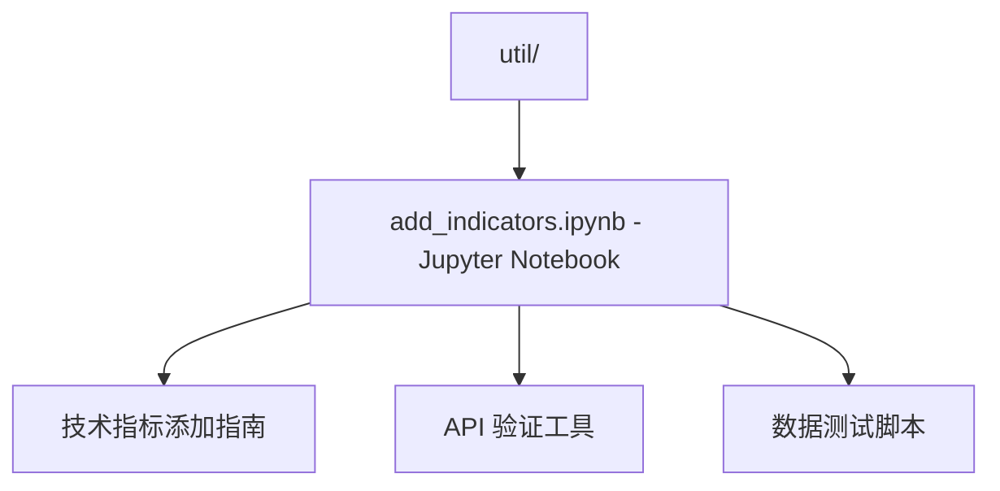

# /util 目录文档

> **导航**: [根目录](../) | 本模块

---

## 📦 目录概览

实用工具目录，包含辅助脚本和 Notebook，帮助开发者和管理员操作项目。



---

## 📄 文件详解

### 1. 技术指标添加 Notebook (`add_indicators.ipynb`)

**文件类型**: Jupyter Notebook (.ipynb)

**主要用途**:
- 验证新的技术指标
- 测试 Taapi.io API 调用
- 生成指标格式参考
- 数据分析可视化

**内容结构** (推测):
```python
# 1. 导入依赖
import requests
import json
import pandas as pd

# 2. API 配置
TAAPIIO_API_KEY = "your_key"
BASE_URL = "https://api.taapi.io"

# 3. 指标测试函数
def test_indicator(indicator: str, symbol: str = "BTC/USDT", interval: str = "1h"):
    # 发起 API 请求
    # 解析响应
    # 验证数据结构
    # 返回结果
    pass

# 4. 可视化结果
def plot_indicator_data(data: dict):
    # 绘制指标图
    # 保存图片
    pass

# 5. 生成参考格式
def generate_reference_format(indicator: str, response: dict):
    # 根据 API 响应生成 JSON 格式
    # 填充默认值
    # 保存到 indicator_format_reference.json
    pass
```

**使用场景**:

```python
# 场景 1: 测试新指标
test_indicator("NEWINDICATOR", "ETH/USDT", "4h")

# 场景 2: 批量验证
symbols = ["BTC/USDT", "ETH/USDT", "BNB/USDT"]
intervals = ["1h", "4h", "1d"]
for symbol in symbols:
    for interval in intervals:
        test_indicator("RSI", symbol, interval)

# 场景 3: 格式生成
response = test_indicator("ICHIMOKU", "BTC/USDT", "1d")
format_json = generate_reference_format("ICHIMOKU", response)
print(json.dumps(format_json, indent=2))
```

**开发流程**:

1. **发现新指标**:
   - 访问 https://taapi.io/indicators
   - 选择未实现的指标

2. **测试验证**:
   ```python
   # 在 Notebook 中测试
   indicator = "WILLR"
   result = test_indicator(indicator)
   print(result)
   ```

3. **生成参考**:
   ```python
   # 自动生成 JSON 格式
   reference = generate_reference_format(indicator, result)
   # 复制到 src/resources/indicator_format_reference.json
   ```

4. **提交 PR**:
   - 更新 `indicator_format_reference.json`
   - 添加测试用例
   - 更新文档

**设计优势**:
- ✅ **交互式开发**: 即时反馈
- ✅ **可视化分析**: 图表展示指标
- ✅ **自动化生成**: 减少手工错误
- ✅ **文档集成**: Notebook 本身就是文档

---

## 🔧 使用指南

### 启动 Notebook
```bash
# 1. 安装 Jupyter
pip install jupyter notebook

# 2. 启动服务
jupyter notebook --ip=0.0.0.0 --port=8888

# 3. 打开浏览器
# http://localhost:8888/notebooks/util/add_indicators.ipynb
```

### 配置 API Key
```python
# 在 Notebook 顶部设置
import os

# 方法 1: 直接赋值 (不推荐)
TAAPIIO_API_KEY = "your_api_key"

# 方法 2: 环境变量
TAAPIIO_API_KEY = os.getenv("TAAPIIO_APIKEY")
if not TAAPIIO_API_KEY:
    raise ValueError("请设置 TAAPIIO_APIKEY 环境变量")

# 方法 3: 配置文件
from dotenv import load_dotenv
load_dotenv("../.env")
TAAPIIO_API_KEY = os.getenv("TAAPIIO_APIKEY")
```

---

## 🧪 测试策略

### API 连接测试
```python
def test_api_connection():
    url = f"{BASE_URL}/RSI?symbol=BTC/USDT&interval=1h&access_key={TAAPIIO_API_KEY}"
    response = requests.get(url)
    assert response.status_code == 200
    data = response.json()
    assert "value" in data
    print("✓ API 连接正常")
```

### 指标验证测试
```python
def validate_indicator(indicator: str, response: dict):
    """验证指标响应格式"""
    required_fields = ["value", "symbol", "interval"]
    for field in required_fields:
        assert field in response, f"缺少字段: {field}"
    print(f"✓ {indicator} 格式正确")
```

### 参数测试
```python
def test_all_intervals(indicator: str):
    """测试所有支持的间隔"""
    intervals = ["1m", "5m", "15m", "30m", "1h", "2h", "4h", "12h", "1d", "1w"]
    for interval in intervals:
        result = test_indicator(indicator, interval=interval)
        print(f"✓ {indicator} @ {interval}")
```

---

## 📊 数据分析

### 指标性能对比
```python
# 比较不同指标的计算时间
import time

def benchmark_indicators(indicators: list, symbol: str = "BTC/USDT"):
    results = {}
    for indicator in indicators:
        start = time.time()
        result = test_indicator(indicator, symbol)
        duration = time.time() - start
        results[indicator] = duration
    return results

# 可视化
import matplotlib.pyplot as plt

def plot_benchmark(results: dict):
    plt.figure(figsize=(10, 6))
    indicators = list(results.keys())
    times = list(results.values())
    plt.bar(indicators, times)
    plt.xlabel("技术指标")
    plt.ylabel("响应时间 (秒)")
    plt.title("Taapi.io 指标响应时间对比")
    plt.xticks(rotation=45)
    plt.tight_layout()
    plt.savefig("benchmark.png", dpi=300)
    plt.show()
```

### 精度验证
```python
# 对比不同数据源的同一指标
def compare_data_sources(indicator: str, symbol: str, interval: str):
    # Taapi.io 数据
    taapi_data = test_indicator(indicator, symbol, interval)

    # 本地计算数据 (如使用 TA-Lib)
    # local_data = calculate_indicator_locally(indicator, symbol, interval)

    # 计算差异
    diff = abs(taapi_data["value"] - local_data["value"])
    print(f"数据差异: {diff}")
```

---

## 🔄 自动化集成

### GitHub Actions 集成
```yaml
# .github/workflows/test-indicators.yml
name: Test Indicators

on:
  push:
    paths:
      - "util/add_indicators.ipynb"

jobs:
  test:
    runs-on: ubuntu-latest
    steps:
      - uses: actions/checkout@v2
      - name: Set up Python
        uses: actions/setup-python@v2
        with:
          python-version: 3.9
      - name: Install dependencies
        run: |
          pip install -r requirements.txt
          pip install jupyter nbconvert
      - name: Execute Notebook
        run: |
          jupyter nbconvert --to python util/add_indicators.ipynb
          python util/add_indicators_executed.py
```

### 预提交钩子
```python
# .pre-commit-config.yaml
repos:
  - repo: local
    hooks:
      - id: test-new-indicators
        name: Test New Indicators
        entry: python util/run_indicator_tests.py
        language: system
        files: src/resources/indicator_format_reference.json
```

---

## 📈 指标开发流程

### 完整的指标添加流程

1. **需求分析**
   ```markdown
   # 新增指标: Williams %R

   ## 需求
   - 名称: Williams %R
   - 参数: period (默认 14)
   - 输出: value (-100 to 0)
   - 间隔: 支持 1m-1d
   ```

2. **API 测试**
   ```python
   # 在 Notebook 中验证
   result = test_indicator("WILLR", "BTC/USDT", "1h")
   print(json.dumps(result, indent=2))
   ```

3. **格式生成**
   ```python
   reference = generate_reference_format("WILLR", result)
   # 输出 JSON 格式供复制
   ```

4. **更新参考文件**
   ```bash
   # 将生成的 JSON 追加到 indicator_format_reference.json
   jq '. + {"WILLR": ...}' src/resources/indicator_format_reference.json \
     > src/resources/indicator_format_reference.json.tmp
   mv src/resources/indicator_format_reference.json.tmp \
     src/resources/indicator_format_reference.json
   ```

5. **测试验证**
   ```python
   # 重新加载并测试
   from src.indicators import TADatabaseClient
   cli = TADatabaseClient()
   cli.validate_indicator("WILLR", {"period": 14})
   ```

6. **提交变更**
   ```bash
   git add src/resources/indicator_format_reference.json
   git commit -m "feat: add Williams %R indicator"
   git push
   ```

---

## 🐛 常见问题

### Q1: Notebook 无法连接 API
**原因**: 环境变量未设置

**解决**:
```python
# 检查环境变量
import os
print("TAAPIIO_APIKEY:", "***" if os.getenv("TAAPIIO_APIKEY") else "未设置")

# 设置临时变量
os.environ["TAAPIIO_APIKEY"] = "your_key"
```

### Q2: 指标名称不匹配
**原因**: Taapi.io 指标名称区分大小写

**解决**:
```python
# 使用正确的名称 (全部小写)
correct = "willr"    # ✓ 正确
incorrect = "WILLR"  # ✗ 错误
```

### Q3: 某些间隔不支持
**原因**: 并非所有指标支持所有时间框架

**解决**:
```python
# 动态检测支持的间隔
def get_supported_intervals(indicator: str):
    all_intervals = ["1m", "5m", "15m", "30m", "1h", "2h", "4h", "12h", "1d", "1w"]
    supported = []
    for interval in all_intervals:
        try:
            test_indicator(indicator, interval=interval)
            supported.append(interval)
        except Exception:
            pass
    return supported
```

---

## 📊 扩展计划

### v4.0 增强
- [ ] **指标比较工具**: 同时测试多个指标
- [ ] **历史数据回测**: 使用历史数据验证指标效果
- [ ] **性能基准**: 记录各指标响应时间
- [ ] **错误监控**: 自动记录 API 错误

### v4.1 扩展
- [ ] **多数据源支持**: 集成 TradingView、CoinGecko
- [ ] **自定义指标**: 支持本地计算指标
- [ ] **Alert 生成器**: 自动生成告警示例
- [ ] **指标文档**: 自动生成指标说明文档

---

## 🔗 相关资源

- [Taapi.io 官方文档](https://taapi.io/docs)
- [Jupyter Notebook 教程](https://jupyter-notebook.readthedocs.io/)
- [Pandas 数据分析](https://pandas.pydata.org/docs/)
- [Matplotlib 可视化](https://matplotlib.org/stable/contents.html)

---

*Generated with Claude Code - 2025-11-08*
